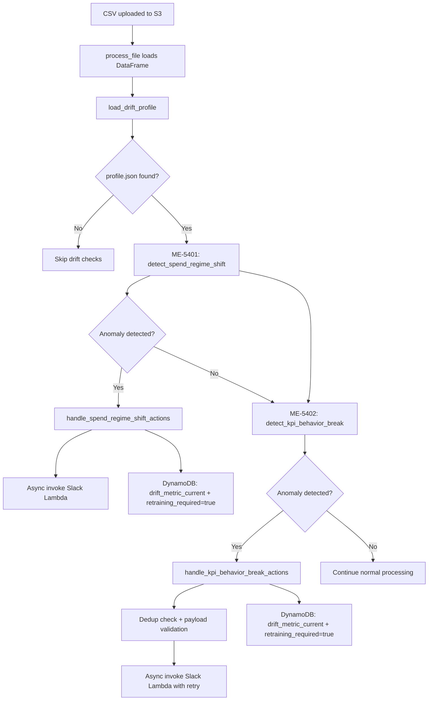

# Data Drift Detection in the Data Ingestion Pipeline

## 1. Overview

The data ingestion pipeline includes two statistical drift detectors that run automatically during weekly file processing. Their purpose is to identify anomalies in incoming data that would degrade model accuracy, and to decide whether retraining is warranted.

| Detector | Ticket | What It Catches |
|---|---|---|
| **Spend Regime Shift** | ME-5401 | A single media channel's spend is statistically extreme compared to its historical distribution |
| **KPI Behavior Break** | ME-5402 | The relationship between total media spend and KPI (e.g. sales) has diverged from what the regression model expects |

Both detectors execute inside the `mmm_dev_data_transfer` Lambda during `process_file`, after the CSV has been loaded into a pandas DataFrame. Both rely on a pre-computed **`profile.json`** bundled with the Lambda deployment package.

---

## 2. Data Flow



---

## 3. Profile (`profile.json`) Structure

The profile is generated offline from historical training data and bundled into the Lambda deployment package. It contains five top-level sections:

### 3.1 `schema`

Column mappings that tell the detectors which columns to examine.

| Field | Example | Used By |
|---|---|---|
| `kpi_col` | `"Target_sales"` | ME-5402 |
| `spend_cols` | `["Google_spend", "Meta_spend", ...]` | ME-5401, ME-5402 |
| `control_cols` | `["GQV", "Seasonality"]` | ME-5402 (feature construction) |
| `event_cols` | `["Christmas", "Thanksgiving", ...]` | ME-5402 (transition suppression) |

### 3.2 `spend_stats`

Per-channel historical statistics used by ME-5401.

```json
"Google_spend": {
    "mean": 29996.79,
    "std": 12520.48,
    "p99": 69967.63,
    "p995": 71089.54,
    "active_weeks": 157
}
```

| Stat | Purpose |
|---|---|
| `mean` | Center of the z-score calculation |
| `std` | Scale of the z-score calculation |
| `p99` | 99th percentile -- yellow trigger if exceeded |
| `p995` | 99.5th percentile -- red trigger if exceeded |
| `active_weeks` | Number of non-zero weeks in training data |

### 3.3 `control_stats`

Per-control-variable statistics used by ME-5402 for z-standardizing control features.

```json
"GQV": {
    "mean": 105.17,
    "std": 9.0
}
```

### 3.4 `residual_profile`

The regression model used by ME-5402 to predict expected KPI from spend and controls.

| Field | Description |
|---|---|
| `feature_names` | Ordered list of feature names: `log1p(spend)`, `z(control)`, event flags, `intercept` |
| `beta` | Corresponding regression coefficients |
| `resid_mean` | Mean of training-set residuals (bias correction) |
| `resid_std` | Standard deviation of training-set residuals (normalization denominator) |

### 3.5 `thresholds`

Configurable cutoff values.

| Key | Default | Used By |
|---|---|---|
| `Z_OUTLIER_YELLOW` | 3.0 | ME-5401 |
| `Z_OUTLIER_RED` | 4.0 | ME-5401 |
| `RESID_Z_YELLOW` | 3.0 | ME-5402 |
| `RESID_Z_RED` | 4.0 | ME-5402 |
| `OPPOSITE_MIN_RESID_Z` | 1.5 | ME-5402 hardening |
| `OPPOSITE_MIN_SPEND_DELTA_PCT` | 0.15 | ME-5402 hardening |
| `EVENT_TRANSITION_SUPPRESS_MAX_RESID_Z` | 1.0 | ME-5402 hardening |

---

## 4. ME-5401: Spend Regime Shift Detection

### 4.1 Purpose

Detects when a single media channel's latest-week spend is statistically extreme compared to its historical distribution. This catches scenarios like a channel suddenly doubling its budget or dropping to zero.

### 4.2 Calculation

For each spend channel in `spend_stats` that also exists in the incoming DataFrame:

```
z_score = (current_value - mean) / std
```

Where:
- `current_value` = spend value from the **latest row** of the incoming data
- `mean` = historical mean from `profile.json > spend_stats > {channel} > mean`
- `std` = historical standard deviation from `profile.json > spend_stats > {channel} > std`

### 4.3 Trigger Conditions

A channel is flagged as anomalous if **either** condition is true:

| Condition | Severity |
|---|---|
| `\|z_score\| >= Z_OUTLIER_YELLOW` (default 3.0) **OR** `current_value > p99` | YELLOW |
| `\|z_score\| >= Z_OUTLIER_RED` (default 4.0) **OR** `current_value > p995` | RED |

### 4.4 Aggregation

- Each channel is evaluated independently
- The overall severity is the **maximum** across all flagged channels (any RED channel makes the overall result RED)
- `drift_metric_current` is set to the **maximum `|z_score|`** across all channels

### 4.5 Worked Example

Given profile stats for `TV_spend`: mean = 119,612, std = 35,385, p99 = 214,316

If the latest week has `TV_spend = 250,000`:

```
z_score = (250,000 - 119,612) / 35,385 = 3.685
|z_score| = 3.685 >= 3.0 (Z_OUTLIER_YELLOW)  -->  YELLOW trigger
250,000 > 214,316 (p99)                       -->  YELLOW trigger (redundant)
|z_score| = 3.685 < 4.0 (Z_OUTLIER_RED)       -->  Not RED by z-score
```

Result: **YELLOW** severity for `TV_spend`.

### 4.6 Output Schema

```json
{
    "detected": true,
    "severity": "YELLOW",
    "anomalies": [
        {
            "channel": "TV_spend",
            "value": 250000.0,
            "mean": 119612.05,
            "std": 35384.56,
            "z_score": 3.685,
            "p99": 214315.92,
            "p995": 229674.53,
            "threshold_breaches": {
                "z_yellow": true,
                "z_red": false,
                "p99": true,
                "p995": true
            },
            "severity": "YELLOW"
        }
    ],
    "drift_metric_current": 3.685,
    "evaluated_channels": 6
}
```

---

## 5. ME-5402: KPI Behavior Break Detection

### 5.1 Purpose

Detects when the KPI (e.g. sales) deviates from what the historical spend-to-KPI regression model predicts. This catches scenarios where:
- Sales spike or crash independently of media spend changes
- Sales move in the opposite direction to what spend changes would predict

### 5.2 Residual Z-Score Calculation (Step by Step)

#### Step 1: Construct feature vector from the latest row

Each feature in `residual_profile.feature_names` is computed from the incoming data:

| Feature pattern | Computation |
|---|---|
| `log1p(Google_spend)` | `math.log1p(latest_row["Google_spend"])` |
| `z(GQV)` | `(latest_row["GQV"] - control_stats["GQV"]["mean"]) / control_stats["GQV"]["std"]` |
| `Christmas` | `latest_row["Christmas"]` (binary 0 or 1) |
| `intercept` | `1.0` |

#### Step 2: Predict expected KPI in log-space

```
pred_log_kpi = sum(beta[i] * feature[i])  for i in range(len(features))
```

This is a dot product of the regression coefficients with the feature vector.

#### Step 3: Compute actual KPI in log-space

```
actual_log_kpi = log1p(latest_kpi)
```

Where `latest_kpi` is the KPI value from the last row of the incoming DataFrame.

#### Step 4: Compute the residual

```
residual_value = actual_log_kpi - pred_log_kpi
```

A positive residual means actual KPI is higher than predicted; negative means lower.

#### Step 5: Standardize to z-score

```
resid_z = (residual_value - resid_mean) / resid_std
```

Where `resid_mean` and `resid_std` come from `residual_profile` in `profile.json`. These represent the mean and standard deviation of residuals observed during training.

**Important:** Because the calculation operates in log-space with a tight `resid_std` (e.g. 0.1738), even moderate deviations produce large z-scores.

### 5.3 Opposite-Direction Check

In addition to the residual z-score, the detector checks whether KPI and total spend move in opposite directions between the last two rows:

```
spend_delta = latest_total_spend - previous_total_spend
kpi_delta   = latest_kpi - previous_kpi
raw_opposite_direction = (spend_delta * kpi_delta) < 0
```

Example: if total spend drops by 50,000 but sales increase by 10,000, this is an opposite-direction signal.

### 5.4 Hardening (False Positive Suppression)

The raw opposite-direction signal alone caused false positives (e.g. post-holiday normalization). Three hardening gates were added:

#### Gate 1: Minimum Residual Evidence

```
opposite_direction = raw_opposite AND |resid_z| >= 1.5
```

The residual must show at least moderate statistical surprise, not just directional mismatch.

#### Gate 2: Material Spend Change

```
spend_delta_pct = |spend_delta| / total_spend_mean
opposite_direction = opposite_direction AND spend_delta_pct >= 0.15
```

The spend change must be at least 15% of the historical total spend baseline, filtering out noise.

#### Gate 3: Event Transition Suppression

```
event_transition_ended = any event column went from 1 (previous row) to 0 (latest row)

if event_transition_ended AND |resid_z| <= 1.0:
    opposite_direction = False
```

When a holiday/event just ended (e.g. Christmas flag 1 -> 0) and the residual is weak, the opposite-direction trigger is suppressed entirely. This prevents false alerts during expected post-event normalization.

### 5.5 Trigger Conditions

The detector fires if **either** condition is true:

| Condition | Description |
|---|---|
| `\|resid_z\| >= RESID_Z_YELLOW` (default 3.0) | Residual trigger -- the KPI is far from what the model predicts |
| `opposite_direction = True` (after hardening) | Opposite trigger -- KPI and spend are moving in conflicting directions with sufficient evidence |

### 5.6 Severity

| Level | Condition |
|---|---|
| RED | `\|resid_z\| >= RESID_Z_RED` (default 4.0) |
| YELLOW | Detected but `\|resid_z\| < RESID_Z_RED` |
| NONE | Not detected |

### 5.7 Output Schema

```json
{
    "detected": true,
    "severity": "YELLOW",
    "anomalies": [
        {
            "kpi_column": "Target_sales",
            "latest_kpi": 840112.54,
            "previous_kpi": 100.0,
            "kpi_delta": 840012.54,
            "latest_total_spend": 311383.0,
            "previous_total_spend": 311383.0,
            "spend_delta": 0.0,
            "spend_delta_pct": 0.0,
            "residual": 2.549,
            "residual_z": 14.67,
            "threshold_breaches": {
                "residual_yellow": true,
                "residual_red": true,
                "raw_opposite_direction": false,
                "opposite_direction": false,
                "event_transition_ended": false
            },
            "severity": "RED"
        }
    ],
    "drift_metric_current": 14.67,
    "opposite_direction": false,
    "event_transition_ended": false
}
```

---

## 6. Alert and Action Pipeline

When either detector flags an anomaly, the following actions execute:

### 6.1 Common Pattern

Both ME-5401 and ME-5402 follow the same action sequence:

```
detect_*() --> handle_*_actions() --> send_*_alert() + update DynamoDB
```

1. **Slack Alert:** The transfer Lambda asynchronously invokes the `data_ingestion_slack` Lambda with the detection payload. The Slack Lambda formats a rich Block Kit message and posts it to the configured webhook.

2. **DynamoDB Update:** `PipelineInfoHelper.update_drift_metrics()` writes:
   - `drift_metric_current` = the maximum `|z_score|` (ME-5401) or `|resid_z|` (ME-5402)
   - `drift_metric_previous` = auto-shifted from the prior `drift_metric_current`
   - `retraining_required = true`

### 6.2 ME-5402 Additional Robustness

The KPI behavior break alert includes additional hardening:

| Feature | Description |
|---|---|
| **Deduplication** | SHA-256 fingerprint of (client, brand, retailer, severity, metrics). If an identical fingerprint was sent within the dedup window (default 3600s), the alert is suppressed. |
| **Payload Validation** | Required fields (`client_id`, `brand_name`, `retailer_id`, `severity`, `anomalies`, `alert_type`) are validated before invoking the Slack Lambda. Invalid payloads fail fast. |
| **Retry with Backoff** | Lambda invoke is retried up to `KPI_ALERT_MAX_RETRIES` (default 3) times with exponential backoff starting at `KPI_ALERT_RETRY_BASE_SECONDS` (default 1.0s). |
| **Correlation ID** | A unique `correlation_id` (format: `kpi-break-<hex>`) is generated per alert and passed to the Slack Lambda for end-to-end tracing. |

### 6.3 DynamoDB Fields Written

| Field | Type | Written By |
|---|---|---|
| `drift_metric_current` | Number | ME-5401, ME-5402 |
| `drift_metric_previous` | Number | Auto-shifted |
| `retraining_required` | Boolean | ME-5401, ME-5402 |

---

## 7. Threshold Configuration Reference

All thresholds can be overridden via `profile.json` or environment variables.

### Profile-based thresholds (in `profile.json > thresholds`)

| Key | Default | Detector | Description |
|---|---|---|---|
| `Z_OUTLIER_YELLOW` | 3.0 | ME-5401 | Min `\|z\|` for yellow spend alert |
| `Z_OUTLIER_RED` | 4.0 | ME-5401 | Min `\|z\|` for red spend alert |
| `RESID_Z_YELLOW` | 3.0 | ME-5402 | Min `\|resid_z\|` for yellow KPI alert |
| `RESID_Z_RED` | 4.0 | ME-5402 | Min `\|resid_z\|` for red KPI alert |
| `OPPOSITE_MIN_RESID_Z` | 1.5 | ME-5402 | Min `\|resid_z\|` for opposite-direction trigger |
| `OPPOSITE_MIN_SPEND_DELTA_PCT` | 0.15 | ME-5402 | Min spend change (%) for opposite-direction trigger |
| `EVENT_TRANSITION_SUPPRESS_MAX_RESID_Z` | 1.0 | ME-5402 | Max `\|resid_z\|` for event-transition suppression |

### Environment variable overrides

| Variable | Default | Description |
|---|---|---|
| `DRIFT_PROFILE_PATH` | `""` (auto-discover) | Path to `profile.json` |
| `KPI_ALERT_MAX_RETRIES` | `3` | Max retry attempts for Slack Lambda invoke |
| `KPI_ALERT_RETRY_BASE_SECONDS` | `1.0` | Base delay (seconds) for exponential backoff |
| `SLACK_MAX_RETRIES` | `3` | Max retry attempts for Slack webhook POST (Slack Lambda) |
| `SLACK_RETRY_BASE_SECONDS` | `1.0` | Base delay for Slack webhook retries (Slack Lambda) |

---

## 8. Key Differences Between the Two Detectors

| Aspect | ME-5401 (Spend Regime Shift) | ME-5402 (KPI Behavior Break) |
|---|---|---|
| **What is measured** | Raw spend per channel | KPI-to-spend relationship via regression residual |
| **Math space** | Raw values | Log-transformed (log1p) |
| **Granularity** | Per-channel (each channel evaluated independently) | Single KPI against all spend channels combined |
| **Data rows used** | Latest row only | Latest + previous row (for delta calculations) |
| **Regression model** | None (simple z-score) | Uses `residual_profile` beta coefficients |
| **False positive hardening** | None needed (simple z-score is robust) | Event transition suppression, min evidence gates |
| **Alert deduplication** | None | None |
| **Retry logic** | Single attempt | Exponential backoff with configurable retries |

---

## 9. ME-5806a: Channel Activation/Deactivation

### 9.1 Purpose
Detects when a channel activates too early (without sufficient history) or a historically strong channel drops to absolute zero spend.

### 9.2 Execution
- Deactivation: checks if `active_weeks >= MIN_ACTIVE_WEEKS_FOR_STABILITY` and `current_value == 0`.
- Activation: checks if `active_weeks < MIN_ACTIVE_WEEKS_FOR_STABILITY` and `current_value > 0`.
- All such anomalies are flagged as `RED` and a Slack alert is sent. DynamoDB receives len(channels_affected).

---

## 10. ME-5806b: Spend Mix Reallocation

### 10.1 Purpose
Detects when the distribution/allocation across channels shifts significantly from the historical average, assuming total spend hasn't dropped to zero.

### 10.2 Execution
Computes:
1. Jensen-Shannon divergence between historical average share distribution and current week share.
2. Max Absolute Share Delta across all available channels.

### 10.3 Thresholds
Flags `YELLOW` if MAX_DELTA >= MIX_SHIFT_YELLOW or JS >= JS_YELLOW.
Flags `RED` if MAX_DELTA >= MIX_SHIFT_RED or JS >= JS_RED.
DynamoDB receives the normalized max metric value.
