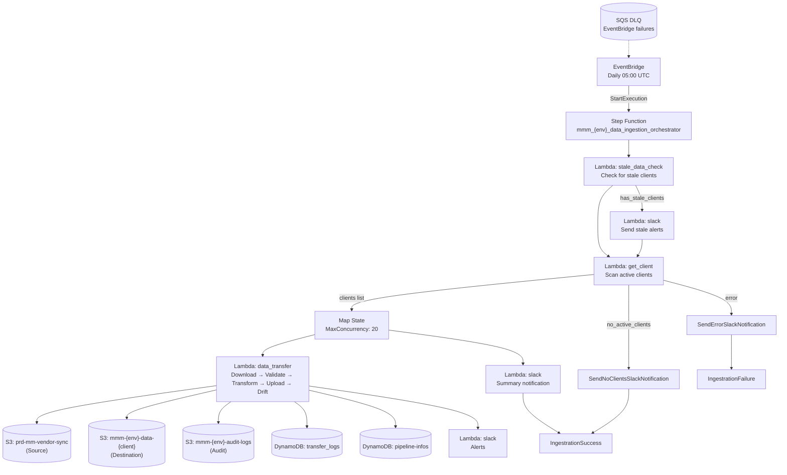
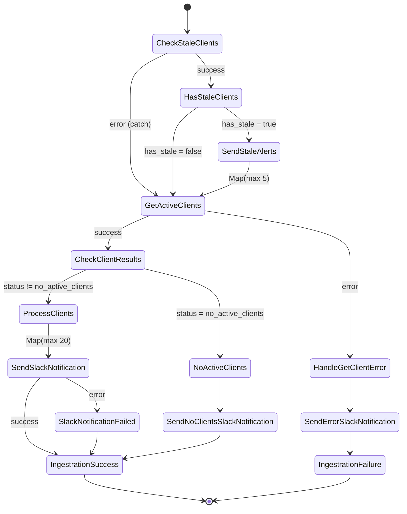
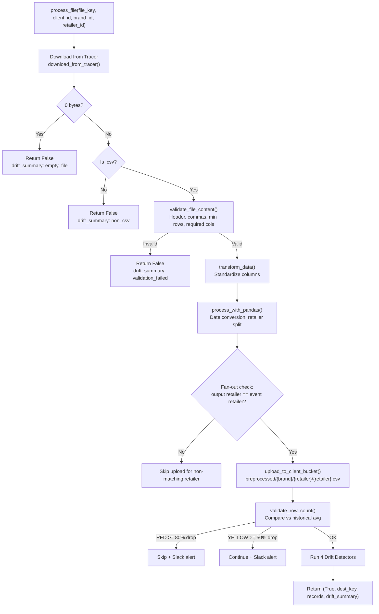

# Data Ingestion Pipeline -- Complete Technical Guide

> **Version**: 3.0.0 | **Last Updated**: April 2026 | **Region**: eu-west-1 | **Team**: Data Engineering

---

## Table of Contents

1. [Overview and Purpose](#1-overview-and-purpose)
2. [Architecture Diagram](#2-architecture-diagram)
3. [Tech Stack (AWS Services)](#3-tech-stack-aws-services)
4. [Step Function Flow](#4-step-function-flow)
5. [Lambda Functions](#5-lambda-functions)
6. [Data Flow (process_file Walkthrough)](#6-data-flow)
7. [Data Validation Guard Rails](#7-data-validation-guard-rails)
8. [Data Drift Detection (4 Detectors)](#8-data-drift-detection)
9. [DynamoDB Tables](#9-dynamodb-tables)
10. [S3 Audit Logs](#10-s3-audit-logs)
11. [Error Handling](#11-error-handling)
12. [Observability](#12-observability)
13. [Deployment Guide](#13-deployment-guide)

---

## 1. Overview and Purpose

The **MMM Data Ingestion Pipeline** is an automated, daily ETL pipeline that:

1. **Discovers** active client/brand/retailer combinations from a DynamoDB configuration table.
2. **Downloads** raw marketing CSV files from the shared **Tracer** S3 bucket (`prd-mm-vendor-sync`).
3. **Validates** file structure, freshness, content quality (sales, channel data), and row count anomalies.
4. **Transforms** the data -- standardizes column names, converts date formats, splits multi-retailer files.
5. **Uploads** cleaned per-retailer CSVs to dedicated **VIP client S3 buckets** (`mmm-{env}-data-{client_id}`).
6. **Runs drift detection** (4 statistical detectors) on each file to flag spend regime shifts, KPI breaks, channel changes, and spend mix reallocation.
7. **Writes audit logs** (JSON) to S3 and DynamoDB for full traceability.
8. **Sends Slack alerts** for successes, failures, drift detections, stale data, and row count anomalies.

### Cadence

| Attribute | Value |
|-----------|-------|
| Schedule | **Daily at 05:00 UTC** via EventBridge |
| Trigger | `cron(0 5 * * ? *)` |
| Concurrency | Up to **20 clients** processed in parallel via Step Function Map state |

### Data Flow Summary

```
Tracer Bucket (prd-mm-vendor-sync)
  └── tracer/
        └── 2026-01-i-health_culturelle_US_national.csv
                │
                ▼
        [Validate → Transform → Split by Retailer → Drift Check]
                │
                ▼
VIP Client Bucket (mmm-{env}-data-{client_id})
  └── preprocessed/{brand}/{retailer}/{retailer}.csv
```

---

## 2. Architecture Diagram



---

## 3. Tech Stack (AWS Services)

### 3.1 Compute

| Resource | Name Pattern | Runtime | Memory | Timeout |
|----------|-------------|---------|--------|---------|
| Lambda - Get Client | `mmm_{env}_get_client` | Python 3.12 | 512 MB | 15s |
| Lambda - Data Transfer | `mmm_{env}_data_transfer` | Python 3.12 | 2048 MB | 60s (300s max) |
| Lambda - Stale Data Check | `mmm_{env}_stale_data_check` | Python 3.12 | 512 MB | 15s |
| Lambda - Slack Notifications | `mmm_{env}_data_ingestion_slack` | Python 3.12 | 256 MB | 15s |
| Step Function | `mmm_{env}_data_ingestion_orchestrator` | Standard | -- | -- |

### 3.2 Storage

| Resource | Name Pattern | Purpose |
|----------|-------------|---------|
| S3 - Tracer (Source) | `prd-mm-vendor-sync` | Shared source bucket, all environments |
| S3 - VIP Client Buckets | `mmm-{env}-data-{client_id}` | Per-client destination buckets |
| S3 - Audit Logs | `mmm-{env}-audit-logs` | Execution audit trail (versioned) |
| DynamoDB - Pipeline Infos | `mmm-{env}-pipeline-infos` | Client/brand/retailer configuration |
| DynamoDB - Transfer Logs | `mmm_{env}_data_transfer_logs` | Per-execution transfer records |

### 3.3 Orchestration and Scheduling

| Resource | Name Pattern | Description |
|----------|-------------|-------------|
| EventBridge Rule | `mmm-data-ingestion-daily-trigger-{env}` | Daily cron at 05:00 UTC |
| SQS Dead Letter Queue | `{env}-data-ingestion-pipeline-dlq` | Catches EventBridge failures |

### 3.4 Lambda Layers

| Layer | ARN Pattern | Used By |
|-------|------------|---------|
| AWS SDK for Pandas | `arn:aws:lambda:{region}:336392948345:layer:AWSSDKPandas-Python312:1` | data_transfer |
| Datadog Extension | `arn:aws:lambda:{region}:464622532012:layer:Datadog-Extension:{version}` | data_transfer, stale_data_check |
| Datadog Python 3.12 | `arn:aws:lambda:{region}:464622532012:layer:Datadog-Python312:{version}` | data_transfer, stale_data_check |

### 3.5 Security

| Resource | Name/ARN | Purpose |
|----------|---------|---------|
| IAM Role - Lambda | `mmm-lambda-execution-role-{env}` | Lambda execution (S3, DynamoDB, CloudWatch, Lambda:Invoke) |
| IAM Role - Step Function | `mmm-step-function-role-{env}` | SFN execution (Lambda invoke, CW Logs, X-Ray) |
| IAM Role - EventBridge | `mmm-eventbridge-stepfunctions-role-{env}` | Start SFN execution |
| Secrets Manager | `mmm/dev/datadog/api-key` | Datadog API key for log/metric forwarding |

---

## 4. Step Function Flow

### State Machine: `mmm_{env}_data_ingestion_orchestrator`



### State-by-State Details

| State | Type | Resource | Retry | Catch |
|-------|------|----------|-------|-------|
| CheckStaleClients | Task | `mmm_{env}_stale_data_check` | 2 attempts, backoff 2x | -> GetActiveClients |
| HasStaleClients | Choice | -- | -- | -- |
| SendStaleAlerts | Map (max 5) | `mmm_{env}_data_ingestion_slack` | 1 attempt | -> StaleAlertFailed (Pass) |
| GetActiveClients | Task | `mmm_{env}_get_client` | TaskFailed: 2 attempts / Timeout: 1 attempt | -> HandleGetClientError |
| CheckClientResults | Choice | -- | -- | -- |
| ProcessClients | Map (max 20) | `mmm_{env}_data_transfer` | 3 attempts, backoff 2x | -> TransferClientDataError (Pass) |
| SendSlackNotification | Task | `mmm_{env}_data_ingestion_slack` | 1 attempt, 2s interval | -> SlackNotificationFailed |
| IngestrationSuccess | Succeed | -- | -- | -- |
| IngestrationFailure | Fail | -- | -- | -- |

### ProcessClients Map Input Schema

Each item in `$.clientsResult.clients` is passed to `data_transfer` with these parameters:

```json
{
  "client_id": "madebygather",
  "client_name": "Made by Gather",
  "brand_id": "bella-US",
  "brand_name": "bella-US",
  "retailer_id": "amazon",
  "retailer_name": "Amazon",
  "region": "eu-west-1",
  "last_trained_date": "2025-12-01",
  "next_training_due": "2025-12-08",
  "brand_retailer_key": "bella-US#amazon",
  "execution_id": "$$.Execution.Id"
}
```

---

## 5. Lambda Functions

### 5.1 `mmm_{env}_get_client` (Lambda 1)

**Purpose**: Retrieve all active client/brand/retailer combinations from DynamoDB.

| Property | Value |
|----------|-------|
| Handler | `lambda_function.lambda_handler` |
| Runtime | Python 3.12 |
| Timeout | 15 seconds |
| Memory | 512 MB |
| Layers | None |

**Environment Variables**:

| Variable | Value |
|----------|-------|
| `DATA_TABLE` | `mmm-{env}-pipeline-infos` |
| `S3_LOG_BUCKET` | `mmm-{env}-audit-logs` |
| `S3_PREFIX` | `get_client_metadata_lambda_logs/` |
| `LOG_LEVEL` | `INFO` (dev/staging), `WARNING` (prod) |

**Logic**:
1. Full table scan on `mmm-{env}-pipeline-infos` (with pagination).
2. Filter in Python: `is_active` must be `1`, `"1"`, `True`, `"ACTIVE"`, or `"active"`.
3. Format each item into the Map state schema (client_id, brand_id, brand_name, retailer_id, etc.).
4. Return `{"clients": [...], "status": "success", "rows_returned": N}`.

**Metrics**: `data_ingestion.get_client.outcome` (tags: `result:success|failed|no_active_clients`).

---

### 5.2 `mmm_{env}_data_transfer` (Lambda 2)

**Purpose**: Core processing Lambda -- download, validate, transform, upload, drift detect.

| Property | Value |
|----------|-------|
| Handler | `lambda_function.lambda_handler` |
| Runtime | Python 3.12 |
| Timeout | 60 seconds (configurable, max 300s) |
| Memory | 2048 MB |
| Layers | Pandas, Datadog Extension, Datadog Python312 |

**Environment Variables**:

| Variable | Value |
|----------|-------|
| `TRACER_BUCKET` | `prd-mm-vendor-sync` |
| `VIP_BUCKET_PREFIX` | `mmm-{env}-data` |
| `SOURCE_PREFIX` | `tracer` |
| `S3_LOG_BUCKET` | `mmm-{env}-audit-logs` |
| `TRANSFER_LOGS_TABLE` | `mmm_{env}_data_transfer_logs` |
| `PIPELINE_INFO_TABLE` | `mmm-{env}-pipeline-infos` |
| `ENVIRONMENT` | `dev` / `staging` / `prod` |
| `LOG_LEVEL` | `INFO` / `WARNING` |
| `MAX_RETRIES` | `3` |
| `DD_API_KEY_SECRET_ARN` | `arn:aws:secretsmanager:eu-west-1:...:secret:mmm/dev/datadog/api-key` |
| `DD_SITE` | `datadoghq.eu` |
| `DD_ENV` | `development` / `staging` / `production` |
| `DD_SERVICE` | `mmm-data-transfer` |
| `DD_TRACE_ENABLED` | `true` |
| `DD_SERVERLESS_LOGS_ENABLED` | `true` |

**Return Schema**:

```json
{
  "statusCode": 200,
  "client_id": "madebygather",
  "brand_name": "bella_us",
  "retailer_id": "amazon",
  "files_processed": 1,
  "records_processed": 104,
  "status": "SUCCESS",
  "timestamp": "2026-04-14T05:02:33.123456Z",
  "execution_id": "abc-123"
}
```

**Metrics**:
- `data_ingestion.transfer.outcome` (tags: `result:success|partial|failed|no_files`)
- `data_ingestion.transfer.duration_ms`

---

### 5.3 `mmm_{env}_stale_data_check` (Lambda 0 -- Pre-check)

**Purpose**: Identify clients with no data update for more than `STALE_THRESHOLD_DAYS`.

| Property | Value |
|----------|-------|
| Threshold (Slack alert) | 3 days |
| Error threshold (ERROR log) | 7 days |
| Layers | Datadog Extension, Datadog Python312 |

**Metric**: `data_ingestion.stale_data.absence_breach` (WARNING: 3 days, ERROR: 7 days).

---

### 5.4 `mmm_{env}_data_ingestion_slack`

**Purpose**: Send Slack notifications for all pipeline events.

**Alert types**: Success summary, failure alert, no active clients, stale data, drift detection, row count drop.

---

## 6. Data Flow

### 6.1 Source File Discovery

Files live in a **flat folder** inside the Tracer bucket:

```
s3://prd-mm-vendor-sync/tracer/
  ├── 2026-01-i-health_culturelle_US_national.csv
  ├── 2026-01-madebygather_bella_us_amazon.csv
  └── 2026-01-madebygather_bella_us_walmart.csv
```

**Discovery process**:
1. `list_objects_v2` with paginator on prefix `tracer/`.
2. **Layer 1**: Skip 0-byte files.
3. **Layer 1.5**: Skip files older than `last_data_updated` (from pipeline-infos).
4. **Layer 2**: Extension check -- only `.csv` files.
5. **Layer 3**: Token-based filename matching via `is_valid_client_file()`.

### 6.2 `process_file` Step-by-Step



### 6.3 Destination Path Structure

```
s3://mmm-{env}-data-{client_id}/
  └── preprocessed/
        └── {brand}/
              └── {retailer}/
                    └── {retailer}.csv
```

Example: `s3://mmm-dev-data-madebygather/preprocessed/bella_us/amazon/amazon.csv`

---

## 7. Data Validation Guard Rails

All validation functions that gate file processing. Every gate produces structured MikAura logs and Datadog metrics.

### 7.1 `is_valid_client_file` -- Filename Token Matching

**Location**: `lambda_function.py` line 1946

Validates that a filename belongs to the expected client/brand/retailer by checking **token containment** (not regex). Robust against date prefixes, different separators (`_` vs `-`), case variations, and extra tokens.

| Check | Behavior |
|-------|----------|
| Empty filename | `False` |
| Not `.csv` extension | `False` |
| `client_id` not in filename | `False` |
| `retailer_id` not in filename | `False` |
| Normalized `brand_id` not in filename | `False` |
| All tokens present | `True` |

### 7.2 `validate_file_content` -- Structural Validation

**Location**: `lambda_function.py` line 2378

| Check | Threshold | Behavior |
|-------|-----------|----------|
| 0-byte file | `len == 0` | Reject |
| Empty/whitespace-only content | After decode | Reject |
| No comma in header row | First line | Reject |
| Header only, no data rows | `< 2 lines` | Reject (minimum `MIN_DATA_ROWS=1` data row) |
| Missing required columns | Per column_standardizer | Reject |

### 7.3 `validate_file_freshness` -- Staleness Gate

**Location**: `lambda_function.py` line 2296

Compares the S3 `LastModified` date of the file against `last_data_updated` from `pipeline-infos`.

| Condition | Result |
|-----------|--------|
| No `last_data_updated` recorded | **Pass** (first run) |
| File date > last processed date | **Pass** |
| File date <= last processed date | **Reject** (stale, logged to `stale_files` in audit) |
| Invalid date format | **Pass** (with warning) |

### 7.4 `validate_row_count` -- Row Count Anomaly Detection

**Location**: `lambda_function.py` line 1780

Compares current row count against `last_transfer_row_count` stored in pipeline-infos.

| Condition | Severity | Action |
|-----------|----------|--------|
| No historical data or < 10 rows | -- | Skip check |
| Drop < 50% | NONE | Pass silently |
| Drop >= 50% but < 80% | **YELLOW** | Continue + Slack alert (WARN) |
| Drop >= 80% | **RED** | Block file + Slack alert (BLOCK) |

**Constants**:
- `ROW_COUNT_DROP_YELLOW_PCT = 50.0`
- `ROW_COUNT_DROP_RED_PCT = 80.0`
- `ROW_COUNT_MIN_HISTORICAL = 10`

### 7.5 `validate_sales_data` -- Sales Column Quality

**Location**: `lambda_function.py` line 2818

Checks all sales columns (identified by `_sales` suffix after column standardization) for null, NaN, or empty-string values. **Zero values are explicitly allowed** (a valid sales figure can be 0).

| Condition | Result |
|-----------|--------|
| All sales cells valid | Pass |
| Any null/NaN/empty in any sales column | Fail + `data_ingestion.validation.sales_missing` metric |

### 7.6 `validate_channel_data` -- Channel Impressions/Spend Quality

**Location**: `lambda_function.py` line 2932

Validates media/retailer channel data across impression and spend columns.

| Check | Condition | Result |
|-------|-----------|--------|
| No `*_impressions` columns at all | Missing | `channel_missing` metric |
| Entire impression column null/empty | All rows blank | `channel_missing` metric |
| Partial nulls in present channels | Some rows blank | `channel_quality` metric |
| Negative values | `< 0` | `channel_quality` metric |
| Non-numeric values | Coerce fails | `channel_quality` metric |

**Metrics**:
- `data_ingestion.validation.channel_missing`
- `data_ingestion.validation.channel_quality`

### 7.7 Empty File Check (In-process)

**Location**: `process_file` function

Files with 0 bytes are rejected immediately after download, before any further processing.

### 7.8 Extension Check (In-process)

**Location**: `process_file` function

Non-`.csv` files are rejected immediately after the empty check.

### 7.9 Fan-out Safety Belt

**Location**: `process_file` function

When `process_with_pandas` splits a multi-retailer CSV, **only the output matching the event's `retailer_id` is uploaded**. This prevents accidental cross-retailer overwrites when a single CSV contains data for multiple retailers.

---

## 8. Data Drift Detection

Four statistical detectors identify data distribution changes that may require model retraining. All detectors run **per file** after successful upload.

### 8.1 Dynamic Profile Building

**Module**: `dynamic_drift_profile.py`

Instead of relying on a static `profile.json`, each retailer's reference profile is built dynamically from its own historical data:

1. `prepare_drift_data(df)` -- Sort by date, split into historical (all except last row) and latest (last row). Requires `MIN_ROWS_FOR_DRIFT = 20`.
2. `infer_schema(df)` -- Auto-detect column roles: spend (`_spend`), impressions (`_impression`), sales (`_sales`), controls (GQV, Seasonality), events (holidays, binary 0/1).
3. `build_reference_profile(historical_df, schema)` -- Compute spend stats (mean, std, p99, p995), ridge regression residual profile, spend mix baseline (avg share per channel).

### 8.2 ME-5401: Spend Regime Shift

Detects anomalous spend levels using z-score against historical mean/std.

| Metric | Threshold |
|--------|-----------|
| `data_ingestion.drift.spend_max_z` (Gauge) | YELLOW: z >= 3.0, RED: z >= 4.0 |
| `data_ingestion.drift.spend_regime_shift` (Counter) | Fires when any spend column exceeds threshold |

### 8.3 ME-5402: KPI Behavior Break

Detects unexpected KPI (sales) behavior using ridge regression residual z-score.

| Metric | Threshold |
|--------|-----------|
| `data_ingestion.drift.kpi_residual_z` (Gauge) | YELLOW: z >= 3.0, RED: z >= 4.0 |
| `data_ingestion.drift.kpi_behavior_break` (Counter) | Fires when residual exceeds threshold |

### 8.4 ME-5806a: Channel Activation/Deactivation

Detects channels appearing or disappearing.

| Parameter | Value |
|-----------|-------|
| `MIN_ACTIVE_WEEKS_FOR_STABILITY` | 8 |
| `CONSEC_ZERO_WEEKS_RED` | 4 |

| Metric | Threshold |
|--------|-----------|
| `data_ingestion.drift.channel_activation_count` (Gauge) | >= 1 = structural change |
| `data_ingestion.drift.channel_activation_deactivation` (Counter) | Fires on detection. Tag: `severity:RED` (disappeared) or `severity:YELLOW` (appeared) |

### 8.5 ME-5806b: Spend Mix Reallocation

Detects shifts in how spend is allocated across channels using Jensen-Shannon divergence and max share delta.

| Metric | Threshold |
|--------|-----------|
| `data_ingestion.drift.spend_mix_normalized` (Gauge) | YELLOW: share delta >= 0.20 or JS >= 0.06 / RED: share delta >= 0.30 or JS >= 0.10 |
| `data_ingestion.drift.spend_mix_reallocation` (Counter) | Fires on detection |

### 8.6 Drift Summary Counter

| Metric | Description |
|--------|-------------|
| `data_ingestion.drift.checked` (Counter) | Emitted once per file after all 4 detectors. Tag `result:{clean\|spend_shift\|kpi_break\|channel_activation\|spend_mix}` |

### 8.7 Actions on Detection

1. **Slack Alert** -- Invokes `mmm_{env}_data_ingestion_slack` with drift details.
2. **DynamoDB Update** -- Sets `retraining_required = True` and updates `drift_metric_current` in pipeline-infos.
3. **Datadog Metrics** -- Emits gauge (magnitude) and counter (event) metrics with severity tags.
4. **Audit Log** -- Full drift results appended to `drift_results` array in S3 audit JSON.

---

## 9. DynamoDB Tables

### 9.1 `mmm-{env}-pipeline-infos` -- Client Configuration

| Attribute | Type | Description |
|-----------|------|-------------|
| `client_id` | String (PK) | Client identifier (e.g., `madebygather`) |
| `brand_retailer_key` | String (SK) | Format: `{brand_id}#{retailer_id}` (e.g., `bella-US#amazon`) |
| `brand_id` | String | Brand identifier (e.g., `bella-US`) |
| `brand_name` | String | Display name for brand |
| `client_name` | String | Display name for client |
| `retailer_id` | String | Retailer identifier (e.g., `amazon`, `national`) |
| `retailer_name` | String | Display name for retailer |
| `mkg_id` | String | Marketing ID |
| `region` | String | AWS region (default `eu-west-1`) |
| `is_active` | Number/String/Bool | Active flag (1, "1", True, "ACTIVE") |
| `status` | String | Pipeline status |
| `retraining_required` | Boolean | Set to `True` when drift detected |
| `prediction_required` | Boolean | Model prediction flag |
| `model_refresh_freq` | String | Training frequency |
| `prediction_refresh_freq` | String | Prediction frequency |
| `last_data_updated` | String | Date of last successful transfer (YYYY-MM-DD) |
| `next_data_update` | String | Expected next update date |
| `last_trained_date` | String | Last model training date |
| `next_training_due` | String | Next training due date |
| `last_prediction_date` | String | Last prediction run |
| `next_prediction_due` | String | Next prediction due |
| `last_transfer_row_count` | Number | Row count from last transfer (for row count validation) |
| `drift_metric_current` | Map | Latest drift detection results |

**Global Secondary Indexes**:
- `ActiveClientsIndex` -- for querying active clients (currently full scan used for compatibility)
- `TrainingScheduleIndex`
- `PredictionScheduleIndex`

### 9.2 `mmm_{env}_data_transfer_logs` -- Transfer Execution Logs

| Attribute | Type | Description |
|-----------|------|-------------|
| `client_id` | String (PK) | Client identifier |
| `timestamp` | String (SK) | ISO-8601 execution timestamp |
| `status` | String | Transfer status (SUCCESS, FAILED, NO_FILES) |
| `files_processed` | Number | Count of files processed |
| `records_processed` | Number | Total data rows processed |
| `execution_id` | String | Lambda request ID |
| `error` | String | Error message (if failed) |

**Global Secondary Index**: `StatusTimestampIndex` (PK: `status`, SK: `timestamp`) -- for querying failed transfers.

**Billing**: PAY_PER_REQUEST (on-demand).

**Point-in-time recovery**: Enabled.

---

## 10. S3 Audit Logs

### Path Format

```
s3://mmm-{env}-audit-logs/data-transfer/{YYYY}/{MM}/{DD}/{client_id}/{brand_name}/{retailer_id}/{execution_id}.json
```

Example:
```
s3://mmm-dev-audit-logs/data-transfer/2026/04/14/madebygather/bella_us/amazon/abc-123-def.json
```

### JSON Schema

```json
{
  "execution_id": "abc-123-def",
  "lambda_name": "mmm-data-transfer-lambda",
  "client_id": "madebygather",
  "brand_name": "bella_us",
  "retailer_id": "amazon",
  "operation": "DATA_TRANSFER",
  "status": "SUCCESS",
  "duration_ms": 4532,
  "files_processed": 1,
  "records_processed": 104,
  "source_files": [
    "s3://prd-mm-vendor-sync/tracer/2026-01-madebygather_bella_us_amazon.csv"
  ],
  "destination_files": [
    "s3://mmm-dev-data-madebygather/preprocessed/bella_us/amazon/amazon.csv"
  ],
  "errors": [],
  "drift_results": [
    {
      "file_key": "tracer/2026-01-madebygather_bella_us_amazon.csv",
      "eligible": true,
      "skip_reason": null,
      "profile_rows": 52,
      "detectors": {
        "spend_regime_shift": {
          "severity": "NONE",
          "max_z": 1.2,
          "flagged_channels": []
        },
        "kpi_behavior_break": {
          "severity": "NONE",
          "residual_z": 0.8
        },
        "channel_activation_deactivation": {
          "severity": "NONE",
          "activated": [],
          "deactivated": []
        },
        "spend_mix_reallocation": {
          "severity": "NONE",
          "js_divergence": 0.02,
          "max_share_delta": 0.05
        }
      },
      "overall_result": "clean"
    }
  ],
  "stale_files": [],
  "timestamp": "2026-04-14T05:02:33.123456+00:00"
}
```

### Lifecycle Policy

| Stage | Days | Storage Class |
|-------|------|---------------|
| Standard | 0-90 | STANDARD |
| Infrequent Access | 90-365 | STANDARD_IA |
| Archive | 365+ | GLACIER |
| Expiration | 2555 (7 years) | Deleted |

---

## 11. Error Handling

### 11.1 Lambda-Level Error Handling

All Lambda functions follow a consistent pattern:

```python
try:
    # Main logic
    _transfer_running(status_logger, "Starting...")
    # ... processing ...
    _transfer_success(status_logger, "Complete")
except Exception as e:
    _transfer_exception(status_logger, "Failed", e)
    write_audit_log_to_s3(...)  # Always log, even on failure
    emit_metrics(result="failed")
    return {"statusCode": 500, "status": "FAILED", "error": str(e)}
```

### 11.2 Step Function Retry Policies

| State | Error | MaxAttempts | BackoffRate |
|-------|-------|-------------|-------------|
| CheckStaleClients | TaskFailed, Timeout | 2 | 2x |
| GetActiveClients | TaskFailed | 2 | 2x |
| GetActiveClients | Timeout | 1 | 1x |
| TransferClientData | TaskFailed | 3 | 2x |
| SendSlackNotification | TaskFailed, Timeout | 1 | 1x (2s interval) |

### 11.3 Step Function Catch Policies

| State | On Error | Transition |
|-------|----------|------------|
| CheckStaleClients | States.ALL | GetActiveClients (continue) |
| GetActiveClients | States.ALL | HandleGetClientError -> SendErrorSlackNotification -> IngestrationFailure |
| TransferClientData | States.ALL | TransferClientDataError (Pass, continue) |
| SendSlackNotification | States.ALL | SlackNotificationFailed -> IngestrationSuccess |

### 11.4 Dead Letter Queue

EventBridge scheduler failures are sent to `{env}-data-ingestion-pipeline-dlq` (SQS). Retention: 14 days.

---

## 12. Observability

### 12.1 Structured Logging (MikAura)

All Lambdas use the `MikAuraStatusLogger` for structured JSON logging to stdout. The Datadog Lambda Extension forwards these to Datadog Logs.

**Log entry fields**:

| Field | Description |
|-------|-------------|
| `timestamp` | ISO-8601 UTC |
| `correlation_id` | Step Function execution ID |
| `environment` | dev / staging / production |
| `pipeline_context` | "Data Ingestion Pipeline" |
| `status` | running / success / failed / warning / info |
| `message` | Human-readable description |
| `level` | DEBUG / INFO / WARNING / ERROR |
| `client_name` | Client ID |
| `brand_name` | Brand name |
| `retailer_name` | Retailer ID |
| `country` | Country code (inferred from brand) |
| `dd.trace_id` | Datadog trace ID (when ddtrace active) |
| `dd.span_id` | Datadog span ID (when ddtrace active) |

**Log levels by environment**:
- dev / staging: `INFO` (verbose)
- production: `WARNING` (reduced noise)

### 12.2 Metrics (Datadog DogStatsD)

Metrics are emitted via the `MikAuraMetricLogger` which sends DogStatsD UDP packets to the Datadog Lambda Extension at `127.0.0.1:8125`.

#### Ingestion Metrics

| Metric | Type | Threshold | Severity |
|--------|------|-----------|----------|
| `data_ingestion.transfer.outcome{result:failed}` | Counter | >= 1 | P2 Critical |
| `data_ingestion.transfer.outcome{result:partial}` | Counter | >= 1 | P3 Warning |
| `data_ingestion.transfer.duration_ms` | Timing | WARNING: >= 240s / CRITICAL: >= 280s | P2 |
| `data_ingestion.get_client.outcome{result:failed}` | Counter | >= 1 | P2 Critical |
| `data_ingestion.get_client.outcome{result:no_active_clients}` | Counter | >= 1 | P3 Warning |
| `data_ingestion.stale_data.absence_breach` | Count | WARNING: 3 days / ERROR: 7 days | P3 |

#### Validation Metrics

| Metric | Type | Threshold |
|--------|------|-----------|
| `data_ingestion.validation.sales_missing` | Counter | >= 1 |
| `data_ingestion.validation.channel_missing` | Counter | >= 1 |
| `data_ingestion.validation.channel_quality` | Counter | >= 1 |

#### Drift Metrics

| Metric | Type | Threshold |
|--------|------|-----------|
| `data_ingestion.drift.spend_max_z` | Gauge | YELLOW: 3.0 / RED: 4.0 |
| `data_ingestion.drift.spend_regime_shift` | Counter | >= 1 |
| `data_ingestion.drift.kpi_residual_z` | Gauge | YELLOW: 3.0 / RED: 4.0 |
| `data_ingestion.drift.kpi_behavior_break` | Counter | >= 1 |
| `data_ingestion.drift.channel_activation_count` | Gauge | >= 1 |
| `data_ingestion.drift.channel_activation_deactivation` | Counter | >= 1 |
| `data_ingestion.drift.spend_mix_normalized` | Gauge | YELLOW: delta >= 0.20 or JS >= 0.06 / RED: delta >= 0.30 or JS >= 0.10 |
| `data_ingestion.drift.spend_mix_reallocation` | Counter | >= 1 |
| `data_ingestion.drift.checked` | Counter | Informational |

### 12.3 Tracing (ddtrace)

The `ddtrace` library is included via the Datadog Python 3.12 Lambda layer. When active, `dd.trace_id` and `dd.span_id` are injected into every MikAura log entry, enabling correlation between logs and traces in Datadog APM.

### 12.4 CloudWatch

| Resource | Configuration |
|----------|---------------|
| Log Groups | `/aws/lambda/mmm_{env}_*` -- 30 days (dev/staging), 90 days (prod) |
| Step Function Logs | `/aws/states/mmm_{env}_data_ingestion_orchestrator` -- ALL level, execution data included |
| Dashboard | `mmm-{env}-data-ingestion-dashboard` -- SFN executions, Lambda metrics, transfer stats |
| Alarms | Enabled per environment via `enable_cloudwatch_alarms` variable |

### 12.5 Slack Notifications

| Event | Alert Content |
|-------|---------------|
| Pipeline Success | Client, files processed, records, duration |
| Pipeline Failure | Client, error message, stack trace |
| No Active Clients | Warning: 0 active clients from DynamoDB |
| Stale Data | Client, days since last update |
| Drift Detection | Detector name, severity, affected channels/metrics |
| Row Count Drop | Current vs historical, % drop, severity |

---

## 13. Deployment Guide

### 13.1 Infrastructure as Code

The pipeline infrastructure is managed with **Terraform** (>= 1.0, AWS provider ~> 5.0).

```
data_ingestion_pipeline/terraform/
  ├── main.tf              # Provider, S3 audit bucket, DynamoDB transfer logs
  ├── lambda.tf            # Lambda functions (get_client, data_transfer) + packaging
  ├── orchestration.tf     # Step Function state machine + CloudWatch logs
  ├── eventbridge.tf       # EventBridge scheduler (daily trigger)
  ├── iam.tf               # IAM roles and policies
  ├── variables.tf         # All configurable variables
  ├── step_function_definition.json  # ASL state machine definition
  └── environments/
        └── dev.tfvars     # Dev environment configuration
```

### 13.2 Terraform Deployment Steps

**Prerequisites**: Terraform CLI installed, AWS credentials configured (`aws configure`), PowerShell.

```powershell
cd data_ingestion_pipeline/terraform

# Step 1: Initialize
terraform init

# Step 2: Select workspace (default = dev)
terraform workspace select default

# Step 3: Create Lambda ZIP packages manually
# --- get_client Lambda ---
$tempDir = New-TemporaryFile | ForEach-Object { Remove-Item $_; New-Item -ItemType Directory -Path $_ }
Copy-Item "..\lambdas\mmm_dev_get_client\lambda_function.py" -Destination "$tempDir\lambda_function.py"
Copy-Item "..\src" -Destination "$tempDir\src" -Recurse -Force
Compress-Archive -Path "$tempDir\*" -DestinationPath "..\lambdas\mmm_dev_get_client\mmm_dev_get_client.zip" -Force
Remove-Item $tempDir -Recurse -Force

# --- data_transfer Lambda ---
$tempDir = New-TemporaryFile | ForEach-Object { Remove-Item $_; New-Item -ItemType Directory -Path $_ }
Copy-Item "..\lambdas\mmm_dev_data_transfer\lambda_function.py" -Destination "$tempDir\lambda_function.py"
Copy-Item "..\lambdas\mmm_dev_data_transfer\dynamic_drift_profile.py" -Destination "$tempDir\dynamic_drift_profile.py"
Copy-Item "..\src" -Destination "$tempDir\src" -Recurse -Force
Compress-Archive -Path "$tempDir\*" -DestinationPath "..\lambdas\mmm_dev_data_transfer\mmm_dev_data_transfer.zip" -Force
Remove-Item $tempDir -Recurse -Force

# Step 4: Plan
terraform plan -var-file="environments/dev.tfvars"

# Step 5: Apply
terraform apply -var-file="environments/dev.tfvars"

# Step 5 (auto-approve variant):
terraform apply -var-file="environments/dev.tfvars" -auto-approve
```

**Important**: Always create the Lambda ZIP packages **before** running `terraform plan`. Terraform evaluates `filebase64sha256()` during the plan phase and will fail if the ZIP does not exist.

### 13.3 Lambda Packaging Details

Each Lambda ZIP must include:

| Lambda | Files Included |
|--------|---------------|
| `mmm_dev_get_client` | `lambda_function.py`, `src/` directory |
| `mmm_dev_data_transfer` | `lambda_function.py`, `dynamic_drift_profile.py`, `src/` directory |

The `src/` directory contains shared utilities:
- `utils/pipeline_config.py` -- Centralized configuration
- `utils/pipeline_info_helper.py` -- DynamoDB pipeline-infos CRUD
- `utils/mikaura_observability.py` -- Structured logging + metrics

### 13.4 Modifying Lambda Code

1. Edit the Lambda source in `data_ingestion_pipeline/lambdas/mmm_dev_{function_name}/lambda_function.py`.
2. If adding a shared utility, place it in `data_ingestion_pipeline/src/utils/`.
3. Re-create the Lambda ZIP package (see Step 3 in section 13.2).
4. Run `terraform plan -var-file="environments/dev.tfvars"` to see the diff.
5. Run `terraform apply -var-file="environments/dev.tfvars"` to deploy.

### 13.5 Modifying the Step Function

1. Edit `data_ingestion_pipeline/terraform/step_function_definition.json`.
2. Lambda ARNs are **replaced at deploy time** by Terraform (hardcoded dev ARNs in the JSON are substituted with actual ARNs via `replace()` in `orchestration.tf`).
3. To add a new state: add it to the JSON, and if it references a new Lambda, add a `replace()` call in `orchestration.tf`.
4. Deploy with `terraform apply -var-file="environments/dev.tfvars"`.

### 13.6 Adding a New Client

1. Add a record to `mmm-dev-pipeline-infos` DynamoDB table with:
   - `client_id` (partition key), `brand_retailer_key` = `{brand_id}#{retailer_id}` (sort key)
   - `is_active = 1`
   - Required fields: `brand_id`, `brand_name`, `retailer_id`, `retailer_name`, `client_name`
2. Add the `client_id` to `client_ids` in `environments/dev.tfvars` (this creates the VIP S3 bucket).
3. Deploy: `terraform apply -var-file="environments/dev.tfvars"`.
4. Ensure the Tracer bucket (`prd-mm-vendor-sync`) contains files matching the pattern `tracer/{date}-{client}_{brand}_{retailer}.csv`.

### 13.7 How to Trigger the Pipeline

#### Automatic Trigger (Daily)

The pipeline runs automatically every day at **05:00 UTC** via EventBridge. No manual action is needed -- EventBridge starts the Step Function execution, which orchestrates all 4 Lambdas.

#### Manual Trigger via AWS Console

1. Open **AWS Step Functions** in the AWS Console (eu-west-1).
2. Find `mmm_dev_data_ingestion_orchestrator`.
3. Click **Start execution**.
4. Leave the input as `{}` (empty JSON) -- the Step Function fetches clients from DynamoDB automatically.
5. Click **Start execution** to confirm.
6. Monitor progress in the **Execution details** view (visual workflow, step history, input/output per state).

#### Manual Trigger via AWS CLI

```bash
aws stepfunctions start-execution \
  --state-machine-arn arn:aws:states:eu-west-1:931493483974:stateMachine:mmm_dev_data_ingestion_orchestrator \
  --input '{}' \
  --region eu-west-1
```

The response returns an `executionArn` you can use to check status:

```bash
aws stepfunctions describe-execution \
  --execution-arn <executionArn> \
  --region eu-west-1
```

#### Manual Trigger -- Single Lambda (for testing one client)

To test a single client/brand/retailer without running the full pipeline:

**Step 1**: Create a test event JSON file (`test_event.json`):

```json
{
  "client_id": "madebygather",
  "client_name": "Made by Gather",
  "brand_id": "bella-US",
  "brand_name": "bella-US",
  "retailer_id": "amazon",
  "retailer_name": "Amazon",
  "region": "eu-west-1",
  "brand_retailer_key": "bella-US#amazon",
  "execution_id": "manual-test-001"
}
```

**Step 2**: Invoke the Lambda:

```bash
aws lambda invoke \
  --function-name mmm_dev_data_transfer \
  --payload file://test_event.json \
  --cli-binary-format raw-in-base64-out \
  --region eu-west-1 \
  response.json
```

**Step 3**: Check the response:

```bash
cat response.json
```

Expected output:

```json
{
  "statusCode": 200,
  "client_id": "madebygather",
  "brand_name": "bella_us",
  "retailer_id": "amazon",
  "files_processed": 1,
  "records_processed": 104,
  "status": "SUCCESS",
  "execution_id": "manual-test-001"
}
```

#### Manual Trigger via AWS Console (Lambda Test)

1. Open **AWS Lambda** in the AWS Console.
2. Find `mmm_dev_data_transfer`.
3. Click the **Test** tab.
4. Paste the test event JSON above.
5. Click **Test**.
6. Review the execution result, logs, and duration.

#### Verifying a Pipeline Run

After any trigger (automatic or manual), verify the run completed successfully:

| Check | How |
|-------|-----|
| Step Function status | AWS Console -> Step Functions -> Executions -> look for `Succeeded` |
| Audit logs in S3 | `aws s3 ls s3://mmm-dev-audit-logs/data-transfer/{YYYY}/{MM}/{DD}/` |
| Transfer logs in DynamoDB | Scan `mmm_dev_data_transfer_logs` for latest `timestamp` |
| VIP bucket data | `aws s3 ls s3://mmm-dev-data-{client}/preprocessed/` |
| Datadog metrics | Check `data_ingestion.transfer.outcome` in Datadog |
| Slack notification | Check the configured Slack channel for success/failure alerts |
| CloudWatch logs | `/aws/lambda/mmm_dev_data_transfer` and `/aws/states/mmm_dev_data_ingestion_orchestrator` |

