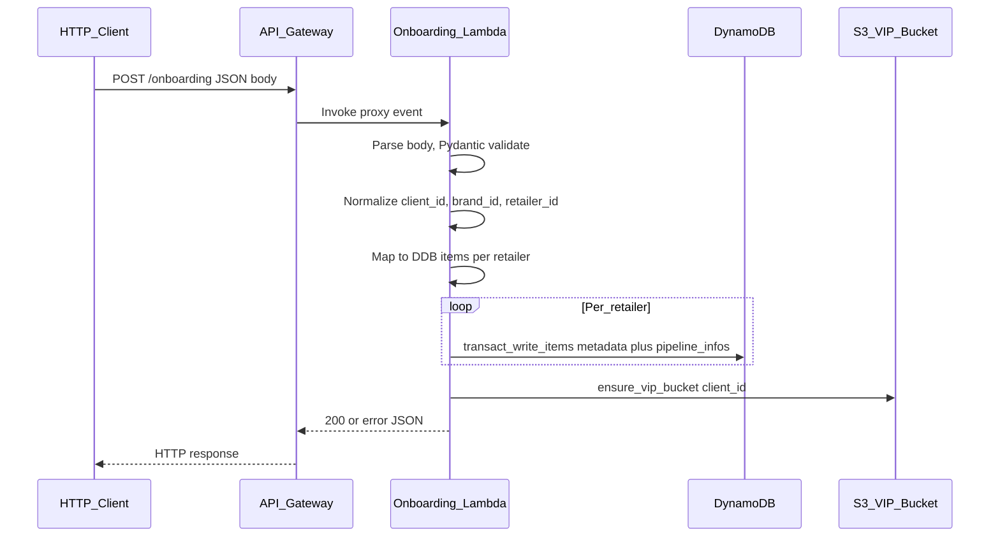

# Onboarding Pipeline — Complete Guide

**Audience:** Client-facing technical documentation (Notion-style).  
**Scope:** How the onboarding API works end-to-end: triggers, payloads, AWS stack, data model, errors, observability, and how to deploy changes.

---

## Table of contents

1. [Overview](#1-overview)  
2. [Architecture and tech stack](#2-architecture-and-tech-stack)  
3. [Pipeline flow](#3-pipeline-flow)  
4. [Trigger](#4-trigger)  
5. [Input payload (full)](#5-input-payload-full)  
6. [Output payloads (full)](#6-output-payloads-full)  
7. [Field creation and normalization](#7-field-creation-and-normalization)  
8. [DynamoDB tables and item shape](#8-dynamodb-tables-and-item-shape)  
9. [Error handling](#9-error-handling)  
10. [Observability](#10-observability)  
11. [How to change and deploy](#11-how-to-change-and-deploy)  
12. [Appendix: Environment variables](#appendix-environment-variables)  

---

## 1. Overview

### Purpose

The **onboarding pipeline** exposes a single HTTP API that accepts client / brand / retailer configuration from an onboarding UI (or any HTTP client). It:

1. **Validates** the JSON body with **Pydantic** models.  
2. **Normalizes** identifiers used across MikMak systems (`client_id`, `brand_id`, `retailer_id`, composite keys).  
3. **Writes** one row per retailer into two existing **DynamoDB** tables (`client_metadata` and `pipeline_infos`) using **atomic transactions** per retailer.  
4. **Provisions** (or ensures) a **VIP S3 bucket** per client for downstream data ingestion, aligned with data-ingestion naming (`mmm-{environment}-data-{client_id}`).

### Who uses it

- **Onboarding UI** or internal tools that call `POST /onboarding`.  
- **Data ingestion** and downstream pipelines consume rows written to `pipeline_infos` and related S3 buckets.

### What this pipeline does *not* do

- No **Step Functions**, **EventBridge** schedules, or **SQS** triggers — only **API Gateway → Lambda**.  
- DynamoDB tables are **referenced** by Terraform (data sources); table **creation** is outside this stack unless you extend it.

---

## 2. Architecture and tech stack

### AWS services

| Service | Role |
|--------|------|
| **API Gateway (REST)** | Regional REST API, `POST /onboarding`, **AWS_PROXY** to Lambda. Optional **resource policy** IP allow-list when not public. |
| **API Gateway (HTTP)** | HTTP API (v2), `POST /onboarding`, public by design; **throttling** and access logs. |
| **Lambda** | Single handler: `lambda_function.lambda_handler` (Terraform package from `onboarding_pipeline/lambda/`). |
| **DynamoDB** | Two **existing** tables: client metadata + pipeline infos (names from tfvars / locals). |
| **S3** | VIP bucket `mmm-{env}-data-{client_id}` created/updated at runtime via `vip_bucket_provisioner`. |
| **IAM** | Dedicated Lambda execution role; bucket policy grants **data transfer** role access to VIP buckets. |
| **CloudWatch Logs** | Lambda log group; HTTP API access log group. |
| **CloudWatch Alarms** | HTTP API high-traffic alarm. |
| **Secrets Manager** | Datadog API key (when Datadog is enabled on the Lambda). |
| **X-Ray** | Lambda tracing mode **PassThrough** (compatible with Datadog / manual tracing). |

### API type and routes

| API | Method | Path pattern | Notes |
|-----|--------|--------------|--------|
| **HTTP API (v2)** | `POST` | `{api_endpoint}/{stage}/onboarding` | Stage name = `env_prefix` (e.g. `dev`, `qa`). **Payload format 1.0** to Lambda for REST-shaped events. |
| **REST API** | `POST` | `{invoke_url}/onboarding` | Stage = `env_prefix`. Can be IP-restricted via resource policy. |

### Endpoint values (how to get the real URLs)

After deploy, Terraform exposes:

- **`http_api_onboarding_endpoint`** — full HTTP URL for `POST /onboarding`.  
- **`api_endpoint`** — full REST URL for `POST /onboarding`.  
- **`testing_instructions`** — copy-paste `curl` examples.

From the repo root (example):

```bash
cd onboarding_pipeline/terraform
terraform output http_api_onboarding_endpoint
terraform output api_endpoint
```

Replace placeholders below with those outputs.

**Example shapes (not real IDs):**

- HTTP: `https://xxxxxxxx.execute-api.eu-west-1.amazonaws.com/dev/onboarding`  
- REST: `https://yyyyyyyy.execute-api.eu-west-1.amazonaws.com/dev/onboarding`

### Application stack (inside Lambda)

- **Python 3.12**  
- **Pydantic** — request validation (`models.py`)  
- **boto3** — DynamoDB `transact_write_items`, S3 control plane  
- **MikAura** (`utils/mikaura_observability.py`) — structured JSON logs + DogStatsD metrics  
- **Datadog** (optional) — Lambda **Extension** + **Python** layers; env vars `DD_*` when enabled in Terraform  

---

## 3. Pipeline flow

High-level sequence:



1. **Parse** `event["body"]` (string or dict) → JSON object.  
2. **Validate** with `OnboardingRequest` (**400** if invalid).  
3. **Derive** `client_id` from `account.name`, `brand_id` from `brand.brandName`, per-retailer IDs.  
4. **Map** to DynamoDB attribute dicts (`mappers.py`).  
5. **Write** each retailer pair in one **transaction** (conditional puts for idempotency).  
6. **VIP bucket** — best-effort provisioning; failures are surfaced in the response but do not always fail the HTTP call if DynamoDB succeeded.  
7. **Respond** with JSON including counts and optional `vip_bucket_error`.

---

## 4. Trigger

### What triggers execution

| Trigger | Description |
|---------|-------------|
| **HTTP API** | Client sends `POST` to the HTTP API invoke URL. **Public** (no API keys / IAM auth in API Gateway). Protection is primarily **rate limiting** (default **50 req/s**, burst **100**) and operational monitoring. |
| **REST API** | Same Lambda. If `is_api_public = false`, a **resource policy** restricts `execute-api:Invoke` to CIDRs in `allowed_ips`. |

### Not used

- **Step Functions** — not part of onboarding.  
- **EventBridge / cron** — not used.  
- **SQS / SNS** — not used for the main path.

---

## 5. Input payload (full)

Content-Type: **`application/json`**.  
Root model: **`OnboardingRequest`** (`onboarding_pipeline/lambda/models.py`).

### Frequency enums

`trainingFrequency` and `predictionRefreshFrequency` must be one of:

`Weekly` | `Monthly` | `Quarterly` | `Semi-Annually` | `Annually`

### Full example JSON (minimal valid shape)

```json
{
  "analysisId": "analysis-uuid-or-string-001",
  "account": {
    "id": "acct-12345",
    "name": "Made By Gather"
  },
  "subaccount": {
    "id": "subacct-001",
    "name": "North America Retail"
  },
  "brand": {
    "id": 42,
    "reportingDisplayName": "Bella US National",
    "countryCode": "US",
    "brandName": "Bella",
    "corporationName": "Example Corp",
    "categoryName": "Personal Care",
    "attributes": {
      "segment": "premium"
    }
  },
  "startDateUtc": 1704067200,
  "endDateUtc": 1735689600,
  "isActive": true,
  "econometrics": ["baseline", "seasonality"],
  "retailers": [
    {
      "retailerId": 101,
      "retailerName": "Amazon",
      "trainingFrequency": "Weekly",
      "predictionRefreshFrequency": "Monthly",
      "mediaChannels": ["Facebook", "CTV", "Search"]
    },
    {
      "retailerId": 102,
      "retailerName": "Walmart",
      "trainingFrequency": "Monthly",
      "predictionRefreshFrequency": "Monthly",
      "mediaChannels": []
    }
  ]
}
```

### Field reference (request)

| Field | Type | Required | Notes |
|-------|------|----------|--------|
| `analysisId` | string | Yes | Non-empty. |
| `account` | object | Yes | `id`, `name` non-empty strings. |
| `subaccount` | object | Yes | `id`, `name` non-empty strings. |
| `brand` | object | Yes | Includes integer `id` (source **actual_brand_id** in DB), `brandName`, `countryCode` (2–3 chars, uppercased), etc. |
| `startDateUtc` | int | Yes | Unix seconds, &gt; 0. |
| `endDateUtc` | int | Yes | Must be **&gt;** `startDateUtc`. |
| `isActive` | bool | Yes | Drives `is_active` in `pipeline_infos` (1 or 0). |
| `econometrics` | string[] | No | Defaults to empty. |
| `retailers` | array | Yes | Min length 1. Each item: `retailerId` (int), `retailerName`, frequencies, optional `mediaChannels`. |

---

## 6. Output payloads (full)

All success and error bodies are JSON inside API Gateway’s `body` string (Lambda returns `statusCode`, `headers`, `body`).

### 6.1 Success — HTTP 200

Typical success body (structure from `lambda_function.py`):

```json
{
  "statusCode": 200,
  "message": "Onboarding data processed successfully",
  "client_id": "madebygather",
  "analysis_id": "analysis-uuid-or-string-001",
  "records_created": 4,
  "vip_bucket_created": true,
  "details": {
    "client_metadata_records": 2,
    "pipeline_infos_records": 2,
    "retailers_processed": 2
  }
}
```

If VIP provisioning fails but DynamoDB succeeded, you may also see:

```json
{
  "statusCode": 200,
  "message": "Onboarding data processed successfully",
  "client_id": "madebygather",
  "analysis_id": "analysis-uuid-or-string-001",
  "records_created": 4,
  "vip_bucket_created": false,
  "details": {
    "client_metadata_records": 2,
    "pipeline_infos_records": 2,
    "retailers_processed": 2
  },
  "vip_bucket_error": "human readable error from S3 / IAM"
}
```

`records_created` is **`metadata_count + pipeline_count`** (each successful or idempotent transaction increments both by 1 per retailer in the inner loop).

### 6.2 Validation error — HTTP 400

Empty body:

```json
{
  "error": "Request body is required",
  "statusCode": 400
}
```

Invalid JSON:

```json
{
  "error": "Invalid JSON in request body",
  "statusCode": 400,
  "details": "Expecting value: line 1 column 1 (char 0)"
}
```

Pydantic validation failure:

```json
{
  "error": "Validation failed: Missing or invalid fields",
  "statusCode": 400,
  "details": [
    {
      "field": "retailers.0.trainingFrequency",
      "message": "Input should be 'Weekly', 'Monthly', 'Quarterly', 'Semi-Annually' or 'Annually'",
      "type": "enum"
    }
  ]
}
```

### 6.3 Duplicate / conflict — HTTP 409

Returned when a **transaction** is canceled for **conditional** reasons at the outer handler (less common if inner idempotency already swallowed duplicates):

```json
{
  "error": "Record already exists. This request was processed previously (idempotent operation).",
  "statusCode": 409,
  "details": {
    "error_code": "ConditionalCheckFailed"
  }
}
```

### 6.4 Server error — HTTP 500

Generic DynamoDB or unexpected failure:

```json
{
  "error": "Database error: ...",
  "statusCode": 500
}
```

or

```json
{
  "error": "Internal server error: ...",
  "statusCode": 500
}
```

### REST-only: HTTP 403

If the REST API is **private** (`is_api_public = false`) and the caller IP is **not** in the allow list, API Gateway returns **403** before Lambda runs (no Lambda body shape guaranteed).

### Throttling — HTTP 429

API Gateway throttling can return **429 Too Many Requests** when limits are exceeded.

---

## 7. Field creation and normalization

Logic lives in `onboarding_pipeline/lambda/normalizers.py` and `mappers.py`.

| Derived field | Source | Rule |
|---------------|--------|------|
| **`client_id`** | `account.name` | Lowercase; all whitespace removed (e.g. `"Made By Gather"` → `madebygather`). |
| **`brand_id`** | `brand.brandName` | Lowercase; spaces removed (e.g. `"Tide Pen"` → `tidepen`). **Not** the same as API `brand.id`. |
| **`retailer_id`** | `retailer.retailerName` | Lowercase; spaces removed (e.g. `"Best Buy"` → `bestbuy`). |
| **`brand_retailer_key`** | `brand_id` + `retailer_id` | `{brand_id}#{retailer_id}` (e.g. `bella#amazon`). Used as **range key** with `client_id` hash key. |
| **`model_id`** | `brand_id`, `retailer_id` | `{brand_id}_{retailer_id}` with `-` in brand normalized to `_` in the left segment only (see `mappers.map_to_client_metadata`). |
| **`actual_brand_id`** | `brand.id` | Integer from payload; stored as-is in DynamoDB. |
| **`actual_retailer_id`** | `retailer.retailerId` | Integer from payload; stored as-is. |

**Important:** `brand_id` in DynamoDB is the **normalized brand name**, not the numeric `brand.id`. The numeric id is stored separately as **`actual_brand_id`**.

---

## 8. DynamoDB tables and item shape

Table names default from `env_prefix` unless overridden in tfvars:

| Logical table | Default name pattern | Terraform local |
|---------------|----------------------|------------------|
| Client metadata | `{env_prefix}-mmm-client-metadata` | `client_metadata_table` |
| Pipeline infos | `mmm-{env_prefix}-pipeline-infos` | `pipeline_infos_table` |

**Example (dev tfvars):** `dev-mmm-client-metadata`, `mmm-dev-pipeline-infos`.

Both tables use:

- **Partition key:** `client_id`  
- **Sort key:** `brand_retailer_key`  

### 8.1 `client_metadata` item (per retailer)

Written by `map_to_client_metadata` (`mappers.py`). Representative keys:

| Attribute | Description |
|-----------|-------------|
| `client_id` | Hash key |
| `brand_retailer_key` | Range key |
| `account_id`, `account_name`, `client_name` | From account |
| `brand_id` | Normalized from `brandName` |
| `actual_brand_id` | Integer `brand.id` |
| `sub_account_id`, `sub_account_name` | From subaccount |
| `brand_name`, `country`, `country_code` | Brand fields (`country` lowercased) |
| `retailer_id`, `retailer_name`, `actual_retailer_id` | Normalized string id + display name + int id |
| `analysis_id` | From payload |
| `start_date_utc`, `end_date_utc` | Unix timestamps from request |
| `econometrics` | List (may be empty) |
| `media_channels` | From retailer |
| `model_id` | Composite model string |
| `has_data` | `false` on create |
| `created_at`, `updated_at` | UTC timestamps (string format from `get_current_timestamp`) |

### 8.2 `pipeline_infos` item (per retailer)

Written by `map_to_pipeline_infos`. Representative keys:

| Attribute | Description |
|-----------|-------------|
| `client_id`, `brand_retailer_key` | Keys |
| `account_id` | From account |
| `brand_id`, `actual_brand_id`, `sub_account_id` | Brand / subaccount |
| `brand_name`, `client_name`, `country_code` | Display / geography |
| `retailer_id`, `retailer_name`, `actual_retailer_id` | Retailer |
| `is_active` | `1` or `0` from `isActive` |
| `status` | `"pending"` for new rows |
| `model_refresh_freq`, `prediction_refresh_freq` | Lowercased frequency strings |
| `mkg_id`, `analysis_id` | Analysis reference (`mkg_id` legacy alias = `analysisId`) |
| `last_data_updated`, `last_trained_date`, `last_prediction_date` | Empty until pipelines update |
| `next_data_update`, `next_training_due`, `next_prediction_due` | Computed next dates |
| `drift_metric_current`, `drift_metric_previous`, `R2` | Initialized (`"0"`) |
| `model_s3_uri` | Empty until model exists |
| `prediction_required`, `retraining_required` | String flags (`"false"`) |
| `created_at`, `updated_at` | UTC timestamps |

### 8.3 Idempotency (conditional writes)

Each `transact_write_items` call uses:

`attribute_not_exists(client_id) AND attribute_not_exists(brand_retailer_key)`

on **both** puts. If the pair already exists, the transaction cancels with **ConditionalCheckFailed** — inner logic treats that as **idempotent skip** and still increments counts where applicable.

---

## 9. Error handling

| Condition | HTTP | Behavior |
|-----------|------|----------|
| Missing body | 400 | `"Request body is required"` |
| Invalid JSON | 400 | Message + parse error in `details` |
| Pydantic validation | 400 | `details` array of `{ field, message, type }` |
| DynamoDB `TransactionCanceledException` + `ConditionalCheckFailed` (outer path) | 409 | Duplicate messaging |
| Other DynamoDB `ClientError` | 500 | Database error message |
| VIP S3 / IAM issues | Often **200** with `vip_bucket_created: false` and `vip_bucket_error` | Non-blocking for main success path |
| Unexpected exception | 500 | Internal server error |

MikAura logs errors and exceptions with structured fields where the status logger is available.

---

## 10. Observability

### Structured logging (MikAura)

- **`MikAuraStatusLogger`** — JSON lines to **stdout** (INFO / WARNING / ERROR / exceptions).  
- Correlation: `correlation_id` = Lambda request ID when available.  
- Context includes `client_id`, `analysis_id`, etc., after validation.

### Metrics (DogStatsD)

Emitted via **`MikAuraMetricLogger`** (UDP to the Datadog extension on `127.0.0.1:8125` when layers are enabled):

| Metric | Type | When |
|--------|------|------|
| `onboarding.invocation` | count | Each invocation |
| `onboarding.duration_ms` | timing | End of request |
| `onboarding.success` / `onboarding.error` | count | Success vs failure path |
| `onboarding.records_created` | gauge | Records written (success path) |

### Datadog (optional)

When `datadog_enabled_onboarding` is true in Terraform:

- Layers: **Datadog Extension** + **Datadog-Python312** (versions from variables).  
- `DD_API_KEY_SECRET_ARN` — Secrets Manager ARN for API key.  
- `DD_ENV`, `DD_SERVICE`, `DD_TAGS`, etc.

### CloudWatch

- **Lambda:** `/aws/lambda/mmm-{env}-onboarding-handler` (retention from `log_retention_days`).  
- **HTTP API access logs:** `/aws/apigateway/mmm-{env}-onboarding-api-http` (JSON format in `api_gateway_http.tf`).  
- **Alarm:** `mmm-{env}-onboarding-api-http-high-requests` — fires if request count exceeds threshold over 5 minutes.

### Security logging

- If `SECURITY_WARNING=true` (set in `lambda.tf` by default for visibility), cold start prints a **stderr** banner.  
- Per-request warnings can log **source IP**, **User-Agent**, path, method when in “public API” monitoring mode.

---

## 11. How to change and deploy

### 11.1 Terraform (primary path in repo)

```bash
cd onboarding_pipeline/terraform
terraform init
terraform plan  -var-file=environments/dev.tfvars
terraform apply -var-file=environments/dev.tfvars
```

Use `qa.tfvars`, `staging.tfvars`, or `prod.tfvars` for other environments.

**After apply**, fetch URLs:

```bash
terraform output http_api_onboarding_endpoint
terraform output api_endpoint
terraform output testing_instructions
```

### 11.2 Changing Lambda code

1. Edit Python under `onboarding_pipeline/lambda/` (`lambda_function.py`, `models.py`, `mappers.py`, `normalizers.py`, `vip_bucket_provisioner.py`, `utils/`).  
2. Run `terraform plan` — `archive_file` hashes the `lambda/` directory; **no manual zip** unless you bypass Terraform.  
3. `terraform apply` updates the function code and config.

**Handler must remain** `lambda_function.lambda_handler` unless you change `lambda.tf` `handler` and zip layout.

### 11.3 Changing API Gateway (REST)

- Edit `api_gateway.tf` (resources, methods, integrations, stage, throttling).  
- REST API deployments may require **new deployment** resource triggers (already managed in Terraform if present in file).  
- Re-apply Terraform.

### 11.4 Changing API Gateway (HTTP)

- Edit `api_gateway_http.tf`.  
- Stage uses **`auto_deploy = true`** — many route/stage changes deploy without a separate “deployment” object.  
- Re-apply Terraform.

### 11.5 Changing IAM, tables, Datadog

- **`iam.tf`** — Lambda permissions (DynamoDB ARNs, S3 patterns, Secrets Manager for Datadog).  
- **Table names** — set `client_metadata_table_name` and `pipeline_infos_table_name` in the right `environments/*.tfvars`.  
- **`datadog_secrets.tf`** / variables — toggle Datadog, secret name, layer versions.

### 11.6 Serverless (alternate CI/CD path)

A parallel layout exists under `onboarding_pipeline/onboarding_cicd/onboarding-pipeline/` with `serverless.yml` and `mmm-onboarding-handler/index.handler`.  
Deploy with Serverless Framework only if your organization uses that path; keep **Terraform** and **Serverless** environments from clashing on the same function names unless intentional.

---

## Appendix: Environment variables

Set by Terraform (`lambda.tf`) unless noted.

| Variable | Purpose |
|----------|---------|
| `CLIENT_METADATA_TABLE` | DynamoDB table name for client metadata |
| `PIPELINE_INFOS_TABLE` | DynamoDB table name for pipeline infos |
| `AWS_REGION_NAME` | Region string for boto3 (`lambda_function.py` / handler) |
| `LOG_LEVEL` | MikAura min level (`DEBUG`, `INFO`, …) |
| `ENVIRONMENT` | Same as `env_prefix` for tagging / VIP bucket env segment |
| `API_SECURITY_MODE` | e.g. `PUBLIC_NO_AUTH` — documented mode string |
| `SECURITY_WARNING` | `true` / `false` — extra stderr / per-request security logging |
| `DATA_TRANSFER_ROLE_ARN` | IAM role granted in VIP bucket policy for data ingestion |
| `VIP_ENCRYPTION_TYPE` | `SSE-S3` or `SSE-KMS` |
| `VIP_KMS_KEY_ARN` | KMS key ARN if SSE-KMS |
| `VIP_ENABLE_VERSIONING` | `true` / `false` |
| `VIP_ENABLE_LOGGING` | `true` / `false` |
| `DD_*` | Present when Datadog enabled (see `lambda.tf` locals merge) |

**Local defaults** in code (if env vars missing — e.g. local test): see module-level constants in `lambda_function.py` for table names and region.

---

## Related internal docs

- [`VIP_BUCKET_AUTO_PROVISION.md`](VIP_BUCKET_AUTO_PROVISION.md) — VIP bucket behavior and response fields.  
- [`ONBOARDING_LAMBDA_IAM_ENVIRONMENTS.md`](ONBOARDING_LAMBDA_IAM_ENVIRONMENTS.md) — IAM and environment notes.  
- [`TICKET_IAM_ONBOARDING_LAMBDA_COPYPASTE.md`](TICKET_IAM_ONBOARDING_LAMBDA_COPYPASTE.md) — Policy snippets for tickets.

---

*Document version: 1.0 — aligned with repository layout under `onboarding_pipeline/`.*
