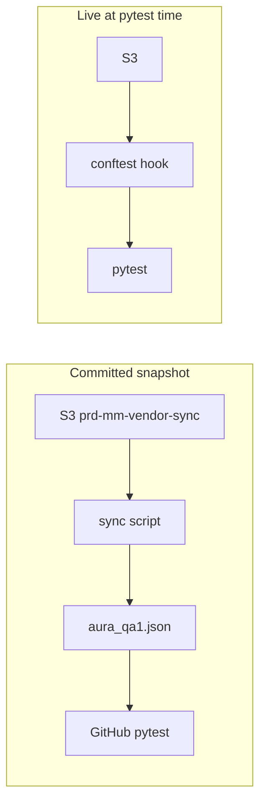

# Aura QA1 tracer: committed snapshot + optional live pytest (no workflow changes)

## Goals

- **Path A (offline CI):** Hosted PR checks keep using **git-committed** data. A script refreshes `[aura_qa1.json](MikGorilla.AI/lambda/data-ingestion-pipeline/tests/fixtures/aura_qa1.json)` `sample_csv` (and `row_count`) from the **newest** matching object in `**prd-mm-vendor-sync`** `tracer/`. After you commit the JSON change, every CI run validates that snapshot—**no S3 access in CI**, **no** edits under `[.github/workflows/](MikGorilla.AI/.github/workflows/)`.
- **Path B (optional, same as prior plan):** `[conftest.py](MikGorilla.AI/lambda/data-ingestion-pipeline/tests/conftest.py)` + env `AURA_QA1_USE_LIVE_TRACER=1` loads latest S3 at **pytest** time when AWS credentials exist (local or self-hosted runner with IAM). Falls back to committed JSON if S3 fails.

## 1. Sync script (Path A)

**Add** `[lambda/data-ingestion-pipeline/scripts/sync_aura_qa1_tracer_from_s3.py](MikGorilla.AI/lambda/data-ingestion-pipeline/scripts/sync_aura_qa1_tracer_from_s3.py)` (or `tools/` under the same pipeline folder—keep under `data-ingestion-pipeline` so paths stay local).

**Behavior:**

- Load `[tests/fixtures/aura_qa1.json](MikGorilla.AI/lambda/data-ingestion-pipeline/tests/fixtures/aura_qa1.json)`.
- Read `client`, `environment` (region), and `validation.exclude_patterns` / extensions from JSON.
- Default bucket `**prd-mm-vendor-sync`**; override with env `LIVE_TRACER_BUCKET` or CLI `--bucket`.
- List `tracer/`, filter with the same rules as production (`[find_tracer_files](MikGorilla.AI/lambda/data-ingestion-pipeline/mmm-data-transfer/index.py)` / `[is_valid_client_file](MikGorilla.AI/lambda/data-ingestion-pipeline/mmm-data-transfer/index.py)`: CSV, exclude patterns, client + normalized brand + retailer tokens), pick **max LastModified** (then size).
- `get_object`, decode UTF-8, split into **one header line** + **data lines** (skip empty lines).
- Update only `sample_csv`: `headers` (string), `rows` (list of strings), `row_count`. Optionally bump `pipeline_info_record.last_transfer_row_count` to match row count for fixture consistency (recommended).
- Write JSON back with stable formatting (`indent=2`, preserve key order if you use a small helper or accept default `json.dump` ordering).
- Exit **0** if updated; **1** if no match or S3 error (with stderr message) so Jenkins/cron can alert.

**Run:** `python scripts/sync_aura_qa1_tracer_from_s3.py` from `lambda/data-ingestion-pipeline` with AWS credentials in the environment (same as AWS CLI).

**Automation (outside workflows):** document that this can run on a schedule from **Jenkins**, **desktop Task Scheduler**, or **Lambda** that clones/commits—explicitly **not** required to live in `.github/workflows/`.

## 2. Optional shared S3 discovery module

To avoid duplicating 80+ lines of matching logic twice, add a small `**tests/tracer_discovery.py`** (or under `scripts/`) with pure functions: `list_matching_tracer_keys`, `pick_latest`, `download_csv_lines`—used by **both** the sync script and **Path B** conftest. Alternatively duplicate minimally in script only and keep conftest separate (simpler but two places to maintain). Plan prefers **one shared module** imported by script with `sys.path` tweak or package-relative path from pipeline root.

## 3. Path B: conftest live flag (unchanged intent)

- Add `**boto3`** to `[requirements-dev.txt](MikGorilla.AI/lambda/data-ingestion-pipeline/requirements-dev.txt)`.
- `**pytest_sessionstart`**: if `AURA_QA1_USE_LIVE_TRACER` is truthy, call shared discovery + merge into `_QA_RAW["sample_csv"]`; on failure warn and keep JSON.

## 4. Documentation

Extend `[UNIT_TEST_COVERAGE.md](MikGorilla.AI/lambda/data-ingestion-pipeline/UNIT_TEST_COVERAGE.md)` or a short `**tests/README.md**` section:

- How to run **sync** before a PR when tracer data changed.
- How to run **pytest with live S3** locally.
- Clarify: **CI without runner IAM** only validates **committed** `aura_qa1.json`.

## Explicit non-goals

- No changes to [pr-status-checks-lambda.yaml](MikGorilla.AI/.github/workflows/pr-status-checks-lambda.yaml), [deploy-sls-lambda.yaml](MikGorilla.AI/.github/workflows/deploy-sls-lambda.yaml), or other workflow files.

## Verification

- Run script with valid AWS: `aura_qa1.json` `sample_csv` changes; `pytest tests/ -v` passes (or surfaces real schema issues).
- With flag off and no S3: CI-equivalent run uses committed file only.

