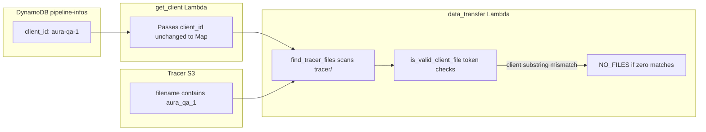

# RCA: `aura-qa-1` (DynamoDB) vs `aura_qa_1` (Tracer filename)

## End-to-end behavior (what actually happens)




1. **[get_client](data_ingestion_pipeline/lambdas/mmm_dev_get_client/lambda_function.py)** reads `client_id` from DynamoDB and forwards it in the Step Functions Map payload **without** rewriting separators. A hyphenated `client_id` is valid for scheduling and for `PipelineInfoHelper.get_pipeline_info(client_id, ...)` lookups as long as the table partition key matches.
2. **[data_transfer](data_ingestion_pipeline/lambdas/mmm_dev_data_transfer/lambda_function.py)** calls `find_tracer_files(client_id, normalized_brand, retailer_id, ...)` (no `expected_filename` on the main path—around lines 5376–5384). That function lists `tracer/` and keeps objects where `is_valid_client_file(...)` returns true.
3. `**is_valid_client_file`** documents that it is meant to tolerate “Different separators: _ vs -” for matching, but the implementation is **not symmetric for all tokens**:
  - **Brand**: `brand_id.lower().replace('-', '_')` and the filename stem is normalized with `name_without_ext.replace('-', '_')` before checking containment—so `bella-US` in Dynamo can match `bella_us` in the filename (see lines 2017–2056 in the same file).
  - **Client**: only `client_id.lower()` is used; there is **no** `replace('-', '_')` on the client token or on the filename for the client check. The test is `client_lower not in name_lower` (substring on the **raw** lowercased filename).
4. **Concrete mismatch**: `client_lower` is `aura-qa-1`. A Tracer file named e.g. `aura_qa_1_brand_retailer_123.csv` has `name_lower` containing `aura_qa_1` but **not** the contiguous substring `aura-qa-1`. The function logs debug (“Client … not found in …”) and returns `False`. Every object is skipped, `matching_files` stays empty, and `find_tracer_files` warns **“No matching files found”**.
5. **Outcome when no matches** (same file, ~5386–5456): early return with HTTP 200, payload `status: 'NO_FILES'`, `files_processed: 0`. Observability paths emit `**no_tracer_files`**, increment `**data_ingestion.transfer.outcome` / `result:no_files`**, write transfer/audit artifacts with status `**NO_FILES**`, and **no `put_object` to the VIP bucket** runs for that client/brand/retailer. Docs describe this as an informational outcome, not necessarily a thrown Lambda error ([DATA_INGESTION_OPERATIONS_AND_DEPLOYMENT.md](data_ingestion_pipeline/docs/DATA_INGESTION_OPERATIONS_AND_DEPLOYMENT.md) troubleshooting row for NO_FILES; [DATA_FLOW.md](data_ingestion_pipeline/docs/DATA_FLOW.md) status table).
6. **Same class of bug for `retailer_id`**: the retailer token is also checked with `retailer_id.lower()` against `name_lower` without hyphen/underscore normalization. If Dynamo had `some-retailer` and Tracer used `some_retailer`, you would get the same kind of miss (in addition to any client mismatch).
7. **VIP bucket naming** uses `get_vip_bucket_name(client_id)` → pattern `mmm-{env}-data-{client_id}` ([lambda_function.py](data_ingestion_pipeline/lambdas/mmm_dev_data_transfer/lambda_function.py) ~4229–4284). That is driven by the **Dynamo** id (`aura-qa-1`), so bucket naming is consistent with onboarding—**the failure is upstream at Tracer discovery**, not at destination path construction.
8. **Onboarding note**: [onboarding_pipeline/lambda/normalizers.py](onboarding_pipeline/lambda/normalizers.py) `normalize_client_id` lowercases and strips spaces only; it **does not** map `_` ↔ `-`. So nothing in that path automatically reconciles vendor file naming with account naming.

## Root cause (single sentence)

**Tracer matching treats brand separators as equivalent across `-` and `_`, but treats client (and retailer) strings literally**, so a hyphenated Dynamo `client_id` does not match underscore-style client tokens in filenames.

## Evidence in code (essential snippet)

Client check uses only `.lower()`; brand check adds `.replace('-', '_')` on both sides of the brand comparison:

```2017:2056:data_ingestion_pipeline/lambdas/mmm_dev_data_transfer/lambda_function.py
    # Step 4: Normalize identifiers
    client_lower = client_id.lower()
    # Normalize brand: bella-US -> bella_us (Tracer uses underscores in filenames)
    brand_normalized = brand_id.lower().replace('-', '_')
    retailer_lower = retailer_id.lower()
    
    # Step 5: Contains-based validation
    if client_lower not in name_lower:
        ...
        return False

    if retailer_lower not in name_lower:
        ...
        return False

    # Step 6: Brand matching (with normalization)
    # Normalize filename for brand comparison (handle both - and _)
    name_normalized = name_without_ext.replace('-', '_')
    if brand_normalized not in name_normalized:
        ...
        return False
```

## Operational symptoms you would see

- CloudWatch / MikAura: “No files found in Tracer”, `debug_event: tracer_discovery`, file validation debug showing client not found in filename.
- Metrics: `result:no_files` on `data_ingestion.transfer.outcome`.
- No new `preprocessed/...` object in `mmm-{env}-data-aura-qa-1` for that run.
- Dynamo `pipeline_infos` “after transfer” updates tied to successful processing may not run for that branch (no file to process).

## Fix directions (only if you choose to change code later)

- **Contract / data fix (lowest risk)**: Align Tracer export naming with Dynamo `client_id` (include `aura-qa-1` literally in the filename) or align Dynamo `client_id` with the vendor’s file token—**one canonical string**.
- **Code fix (behavioral)**: Extend the same normalization used for brand to **client and retailer** (e.g. compare `client_id.lower().replace('-', '_')` against `name_without_ext.lower().replace('-', '_')`), with care to avoid accidental substring collisions across clients.
- **Docs**: The ops guide’s NO_FILES row mentions `{client_id}_{brand_id}_{retailer_id}_*.csv` and brand normalization; it could explicitly warn that **client_id must appear in the filename with the same separators as in Dynamo** given current code.

No code or infra changes are proposed in this read-only RCA; this is analysis only.