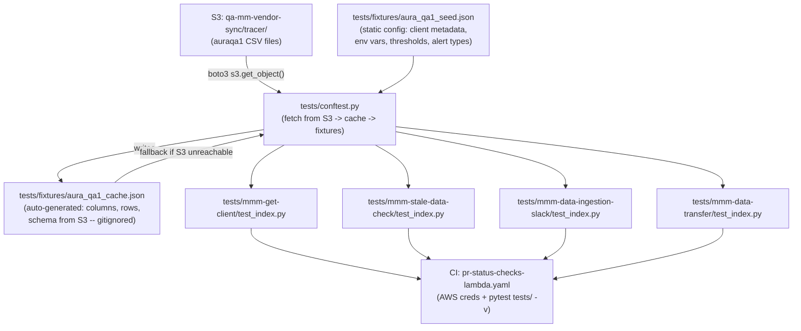

# Data Ingestion Pipeline -- Comprehensive Unit Tests

## Architecture: Live S3 Data + Local Cache

Tests fetch the latest auraqa1 CSV files directly from `qa-mm-vendor-sync/tracer/` in S3. The fetched data (columns, rows, schema) is cached locally so tests also work offline. When data changes in S3, the next test run picks it up automatically.




### How auto-pickup works

1. `conftest.py` session-scoped fixture calls `boto3.client("s3").list_objects_v2(Bucket="qa-mm-vendor-sync", Prefix="tracer/")` filtered for auraqa1 files
2. Downloads the CSV files, parses headers (column names), row count, sample rows, date range
3. Merges this live data with static config from `aura_qa1_seed.json` (client_id, env vars, thresholds)
4. Saves the merged result to `aura_qa1_cache.json` (gitignored)
5. If S3 is unreachable (no credentials, offline), loads from the cache instead
6. All test fixtures (`qa_columns`, `qa_sample_csv_bytes`, `qa_row_count`, etc.) are derived from this merged config

When auraqa1 data changes in S3 (new columns, new rows, new dates), the next test run auto-detects it.

---

## CI Integration

[pr-status-checks-lambda.yaml](MikGorilla.AI/.github/workflows/pr-status-checks-lambda.yaml) already runs `pytest tests/ -v`. We need to add an AWS credentials step before the pytest step so the S3 fetch works in CI. Two options:

- **Option A (recommended):** Use `aws-actions/configure-aws-credentials@v4` with OIDC role that has `s3:GetObject` + `s3:ListBucket` on `qa-mm-vendor-sync`
- **Option B:** Add `AWS_ACCESS_KEY_ID` + `AWS_SECRET_ACCESS_KEY` as GitHub secrets

If neither is available at first, tests gracefully fall back to the committed cache file.

---

## File Structure

```
data-ingestion-pipeline/
  pytest.ini
  requirements-dev.txt                    # add pytest-mock, boto3
  tests/
    __init__.py
    conftest.py                           # S3 fetch + cache + all fixtures
    fixtures/
      aura_qa1_seed.json                  # static config (committed)
      aura_qa1_cache.json                 # auto-generated from S3 (gitignored)
      .gitignore                          # ignores aura_qa1_cache.json
    mmm-get-client/
      __init__.py
      test_index.py
    mmm-stale-data-check/
      __init__.py
      test_index.py
    mmm-data-ingestion-slack/
      __init__.py
      test_index.py
    mmm-data-transfer/
      __init__.py
      test_index.py
```

---

## 1. Static Seed Config: `tests/fixtures/aura_qa1_seed.json`

Committed to repo. Contains values that do NOT come from S3 data files (client metadata, AWS resource names, thresholds, alert types). These are updated manually only when the QA environment config changes.

```json
{
  "client": {
    "client_id": "auraqa1",
    "brand_id": "auraqa1-US",
    "brand_name": "auraqa1-US",
    "retailer_id": "walmart",
    "retailer_name": "Walmart",
    "country": "US"
  },
  "environment": {
    "stage": "qa",
    "aws_region": "eu-west-1",
    "pipeline_info_table": "mmm-qa-pipeline-infos",
    "transfer_logs_table": "mmm-qa-data-transfer-logs",
    "audit_logs_bucket": "mmm-qa-audit-logs",
    "tracer_bucket": "qa-mm-vendor-sync",
    "vip_bucket_prefix": "mmm-qa-data-auraqa1",
    "slack_lambda_name": "sls-data-ingestion-pipeline-mmm-data-ingestion-slack-qa"
  },
  "s3_discovery": {
    "bucket": "qa-mm-vendor-sync",
    "prefix": "tracer/",
    "client_token": "auraqa1"
  },
  "stale_data": {
    "stale_threshold_days": 3,
    "data_absence_error_threshold_days": 14
  },
  "slack_alerts": {
    "webhook_secret_arn": "arn:aws:secretsmanager:eu-west-1:931493483974:secret:mmm/shared/slack/webhook-url",
    "alert_types": [
      "SCHEMA_DRIFT", "COLUMN_DROP", "INVALID_SALES_DATA",
      "MISSING_CHANNEL_DATA", "DUPLICATE_DATES", "DATE_GAPS",
      "ROW_COUNT_DROP", "SPEND_REGIME_SHIFT", "KPI_BEHAVIOR_BREAK",
      "CHANNEL_ACTIVATION_DEACTIVATION", "SPEND_MIX_REALLOCATION",
      "STALE_DATA"
    ]
  },
  "validation": {
    "valid_extensions": [".csv", ".parquet", ".json"],
    "exclude_patterns": ["test", "backup", "archive", "old", "temp", "tmp", "sample"],
    "min_data_rows": 1,
    "row_count_drop_yellow_pct": 50,
    "row_count_drop_red_pct": 80
  }
}
```

---

## 2. Auto-Generated Cache: `tests/fixtures/aura_qa1_cache.json`

Created/updated automatically by `conftest.py` when S3 is accessible. Gitignored so it never goes stale in the repo. Structure (example):

```json
{
  "fetched_at": "2026-04-15T10:30:00Z",
  "files_found": [
    {"key": "tracer/auraqa1_auraqa1-US_walmart_1.csv", "size": 4096, "last_modified": "2026-04-10T08:00:00Z"}
  ],
  "csv_data": {
    "auraqa1_auraqa1-US_walmart_1.csv": {
      "headers": ["Date", "Sales", "In_stock_Rate", "GQV", "OOH_impressions", "OOH_spend", "..."],
      "row_count": 52,
      "sample_rows": ["2025-01-06,15000,0.92,...", "2025-01-13,16000,0.91,..."],
      "all_rows_csv": "Date,Sales,...\n2025-01-06,15000,...\n...",
      "date_range": {"min": "2025-01-06", "max": "2025-12-29"},
      "column_count": 13
    }
  },
  "derived": {
    "all_columns": ["Date", "Sales", "In_stock_Rate", "..."],
    "media_columns": ["OOH_impressions", "OOH_spend", "..."],
    "retailer_columns": ["Walmart_spend", "Walmart_impressions"],
    "total_rows": 52,
    "latest_date": "2025-12-29"
  }
}
```

---

## 3. `tests/conftest.py` -- S3 Fetch + Cache + Fixtures

Core logic (session-scoped, runs once per pytest session):

```python
@pytest.fixture(scope="session")
def qa_config():
    seed = _load_json("fixtures/aura_qa1_seed.json")
    live_data = _try_fetch_from_s3(seed["s3_discovery"])  # returns None if S3 unreachable
    if live_data:
        _save_cache(live_data)
    else:
        live_data = _load_cache_or_fail()
    return {**seed, "live": live_data}
```

`_try_fetch_from_s3()`:

- `s3.list_objects_v2(Bucket, Prefix)` -> filter keys containing `client_token`
- For each matching CSV: `s3.get_object()` -> read body -> parse headers, count rows, extract sample
- Build the `derived` section (all_columns, media_columns, retailer_columns, total_rows)
- Wrapped in try/except: returns None on any AWS error (NoCredentialsError, ClientError, etc.)

Key fixtures derived from `qa_config`:

- `qa_client` -> `qa_config["client"]`
- `qa_env` -> `qa_config["environment"]`
- `qa_columns` -> `qa_config["live"]["derived"]["all_columns"]` (auto from S3)
- `qa_media_columns` -> `qa_config["live"]["derived"]["media_columns"]`
- `qa_sample_csv_bytes` -> first file's `all_rows_csv` encoded to bytes
- `qa_sample_df` -> pandas DataFrame from the CSV
- `qa_row_count` -> `qa_config["live"]["derived"]["total_rows"]`
- `qa_pipeline_info` -> built from seed client + live data (row_count, latest_date as last_data_updated)
- `mock_context`, `mock_dynamodb`, `mock_s3`, `mock_lambda_client` -> MagicMocks
- `mock_boto3_env` -> patches os.environ with QA env vars

`sys.path` inserts for all 4 lambda directories so `import index` works.

---

## 4. `requirements-dev.txt` Updates

Add to existing `flake8` + `pytest`:

```
pytest-mock
boto3
```

Note: `boto3` is needed for the S3 fetch in conftest. It is already installed in Lambda runtime, but the test runner needs it too. No `moto` needed since we mock AWS calls in unit tests and only use real S3 for the fixture fetch.

---

## 5. `pytest.ini`

```ini
[pytest]
testpaths = tests
pythonpath = .
```

---

## 6. Detailed Test Specifications Per Lambda

### 5A. `tests/mmm-get-client/test_index.py`

Source: [mmm-get-client/index.py](MikGorilla.AI/lambda/data-ingestion-pipeline/mmm-get-client/index.py)

**Functions under test:** `handler` (line 385), `validate_table_exists` (line 242), `fetch_metadata_active_clients` (line 264), `format_client_metadata` (line 324), `write_log_to_s3` (line 212)

**Tests (all use auraqa1 values from fixture):**

1. `test_handler_returns_active_clients_success` -- Mock DynamoDB scan returns `qa_pipeline_info` record. Assert handler returns `statusCode: 200`, `clients` list containing auraqa1 client_id, brand, retailer from fixture.
2. `test_handler_returns_no_active_clients` -- Mock DynamoDB scan returns empty Items. Assert handler returns `status: "no_active_clients"`, empty `clients` list.
3. `test_handler_dynamodb_error_raises_runtime_error` -- Mock DynamoDB scan raises `ClientError`. Assert handler raises `RuntimeError`.
4. `test_validate_table_exists_success` -- Mock `dynamodb.Table()` succeeds. Assert returns table object.
5. `test_validate_table_exists_missing_table` -- Mock `dynamodb.Table().table_status` raises `ResourceNotFoundException`. Assert raises exception.
6. `test_fetch_metadata_active_clients_filters_inactive` -- DynamoDB returns mix of `is_active=1` and `is_active=0`. Assert only active records returned. Values from fixture `pipeline_info_record`.
7. `test_fetch_metadata_active_clients_paginates` -- Mock scan with `LastEvaluatedKey` on first call, no key on second. Assert all items collected.
8. `test_format_client_metadata_parses_brand_retailer_key` -- Pass `qa_pipeline_info` item. Assert output dict has correct `brand_id`, `retailer_id` parsed from `brand_retailer_key` = `"auraqa1-US#walmart"`.
9. `test_format_client_metadata_configurable_fields` -- Verify all fields from fixture's `pipeline_info_record` appear in formatted output.
10. `test_write_log_to_s3_success` -- Mock S3 `put_object`. Assert called with bucket from `qa_env["audit_logs_bucket"]`.
11. `test_write_log_to_s3_error_swallowed` -- Mock S3 raises `ClientError`. Assert no exception propagated.

---

### 5B. `tests/mmm-stale-data-check/test_index.py`

Source: [mmm-stale-data-check/index.py](MikGorilla.AI/lambda/data-ingestion-pipeline/mmm-stale-data-check/index.py)

**Functions under test:** `handler` (line 172), `get_stale_clients` (line 72)

**Tests:**

1. `test_handler_returns_stale_clients` -- Mock DynamoDB with `qa_config["stale_data"]["stale_client_example"]` (last_data_updated = "2025-03-01", very stale). Assert handler returns `stale_clients` list with `days_stale` > threshold from fixture.
2. `test_handler_returns_empty_when_all_fresh` -- Mock DynamoDB with `last_data_updated` = today. Assert `stale_clients` is empty.
3. `test_handler_custom_threshold_from_event` -- Pass `{"stale_threshold_days": <value from fixture>}` in event. Assert threshold used matches fixture value.
4. `test_handler_default_threshold_from_env` -- No threshold in event; mock env `STALE_THRESHOLD_DAYS`. Assert env value used.
5. `test_get_stale_clients_filters_inactive` -- DynamoDB returns active + inactive. Assert only `is_active=1` returned.
6. `test_get_stale_clients_skips_missing_last_data_updated` -- Record has no `last_data_updated` field. Assert skipped (not in result).
7. `test_get_stale_clients_computes_days_stale_correctly` -- Use fixture's stale client. Assert `days_stale` matches expected delta from `last_data_updated` to now.
8. `test_get_stale_clients_enriches_brand_retailer` -- Record has `brand_retailer_key` = `"auraqa1-US#walmart"`. Assert output has `brand_name`, `retailer_id` parsed.
9. `test_handler_critical_absence_threshold` -- Client stale beyond `data_absence_error_threshold_days` from fixture. Assert `critical_absence: true` in response.
10. `test_handler_dynamodb_error_returns_error_dict` -- Mock scan raises `ClientError`. Assert handler returns dict with `error` key (does not re-raise).

---

### 5C. `tests/mmm-data-ingestion-slack/test_index.py`

Source: [mmm-data-ingestion-slack/index.py](MikGorilla.AI/lambda/data-ingestion-pipeline/mmm-data-ingestion-slack/index.py)

**Functions under test:** `handler` (line 1992), `_resolve_slack_webhook_url` (line 66), `send_slack_notification` (line 334), `format_slack_message` (line 186), `extract_results_from_event` (line 414), plus all 12 `handle_*` / `format_*` alert functions.

**Tests:**

**Webhook resolution:**

1. `test_resolve_webhook_from_secrets_manager` -- Mock `boto3.client("secretsmanager").get_secret_value` returns URL. Assert URL returned. ARN from `qa_config["slack_alerts"]["webhook_secret_arn"]`.
2. `test_resolve_webhook_falls_back_to_env` -- Secrets Manager raises. Mock `SLACK_WEBHOOK_URL` env. Assert env value used.

**Handler dispatch (parametrized across all alert_types from fixture):**
3. `test_handler_dispatches_to_correct_alert_handler[ALERT_TYPE]` -- `@pytest.mark.parametrize("alert_type", qa_config["slack_alerts"]["alert_types"])`. For each type, mock the corresponding `handle_*` function. Assert it was called. Uses auraqa1 client values in event payload.

1. `test_handler_default_path_sends_completion_summary` -- Event without `alert_type` or `days_stale`. Assert `format_slack_message` + `send_slack_notification` called.
2. `test_handler_returns_500_on_exception` -- Mock `send_slack_notification` raises. Assert `statusCode: 500`.

**send_slack_notification:**
6. `test_send_slack_notification_posts_to_webhook` -- Mock `urllib3.PoolManager.request`. Assert POST to webhook URL with JSON body.

1. `test_send_slack_notification_retries_on_failure` -- Mock HTTP returns 500 first, 200 second. Assert retried and returns True.
2. `test_send_slack_notification_returns_false_after_max_retries` -- All retries fail. Assert returns False.

**format_slack_message:**
9. `test_format_slack_message_success_status` -- Pass success results with auraqa1 client. Assert green color, correct client_id in blocks.

1. `test_format_slack_message_partial_status` -- Mix of success + failed. Assert warning color.
2. `test_format_slack_message_caps_client_list_at_10` -- Pass 15 clients. Assert only 10 shown + truncation note.

**extract_results_from_event:**
12. `test_extract_results_all_success` -- All `ProcessClients` items succeed. Assert overall status = `SUCCESS`.

1. `test_extract_results_partial_failure` -- Mix. Assert `PARTIAL`.
2. `test_extract_results_all_failed` -- All fail. Assert `FAILED`.
3. `test_extract_results_no_active_clients` -- Empty ProcessClients. Assert `NO_ACTIVE_CLIENTS`.

**Per-alert format + handle (parametrized where possible):**

1. `test_format_schema_drift_alert_contains_client_info` -- auraqa1 values. Assert Slack payload includes client_id, brand, retailer from fixture.
2. `test_handle_schema_drift_alert_sends_notification` -- Mock `send_slack_notification`. Assert called with formatted payload.
3. `test_format_column_drop_alert_lists_dropped_columns` -- Pass dropped columns subset of fixture's `sot_schema.column_order`. Assert they appear in Slack blocks.
4. `test_handle_column_drop_alert_posts_to_webhook` -- Mock HTTP. Assert POST made.
5. `test_format_invalid_sales_alert_shows_invalid_columns` -- Pass `invalid_columns` from fixture's `required_columns`. Assert in payload.
6. `test_handle_invalid_sales_alert_posts_to_webhook` -- Mock HTTP. Assert POST.
7. `test_format_missing_channel_alert_lists_channels` -- Missing channels from fixture's `media_channels`. Assert in payload.
8. `test_handle_missing_channel_alert_sends_notification` -- Mock `send_slack_notification`. Assert called.
9. `test_format_duplicate_dates_alert` -- Duplicate dates from fixture CSV. Assert in payload.
10. `test_handle_duplicate_dates_alert_posts` -- Mock HTTP.
11. `test_format_date_gaps_alert` -- Gap weeks. Assert in payload.
12. `test_handle_date_gaps_alert_posts` -- Mock HTTP.
13. `test_format_row_count_drop_alert_thresholds` -- Use fixture's `row_count_drop_yellow_pct` and `row_count_drop_red_pct`. Assert severity matches.
14. `test_handle_row_count_drop_alert_posts` -- Mock HTTP.
15. `test_format_spend_regime_shift_alert` -- Anomalies payload with auraqa1 values. Assert formatted.
16. `test_handle_spend_regime_shift_alert_sends` -- Mock `send_slack_notification`.
17. `test_format_kpi_behavior_break_alert` -- KPI anomalies. Assert formatted.
18. `test_handle_kpi_behavior_break_alert_sends` -- Mock `send_slack_notification`.
19. `test_format_channel_activation_deactivation_alert` -- Channels from fixture's media list. Assert formatted.
20. `test_handle_channel_activation_deactivation_alert_sends` -- Mock notification.
21. `test_format_spend_mix_reallocation_alert` -- Share shifts. Assert formatted.
22. `test_handle_spend_mix_reallocation_alert_sends` -- Mock notification.
23. `test_handle_stale_alert_sends_for_stale_client` -- Use fixture's `stale_data.stale_client_example`. Assert `send_slack_notification` called.
24. `test_handler_stale_path_triggered_by_days_stale_in_event` -- Event has `days_stale` but no `alert_type`. Assert stale handler invoked.

---

### 5D. `tests/mmm-data-transfer/test_index.py`

Source: [mmm-data-transfer/index.py](MikGorilla.AI/lambda/data-ingestion-pipeline/mmm-data-transfer/index.py)

**Existing tests at `lambda/mmm-data-transfer/tests/`** cover output format, harmonization, and drift. This new file focuses on the handler flow, validation, and alert dispatch using auraqa1 fixture data.

**Tests:**

**Handler basics:**

1. `test_handler_missing_client_id_returns_error` -- Event without `client_id`. Assert error response.
2. `test_handler_missing_retailer_id_returns_error` -- Event without `retailer_id`. Assert error.
3. `test_handler_valid_event_structure` -- Full auraqa1 event from fixture. Mock all AWS calls. Assert 200 response with expected keys.
4. `test_handler_no_files_found_returns_no_files` -- Mock `s3_client.list_objects_v2` returns empty. Assert `status: "NO_FILES"`, `files_processed: 0`.

**normalize_brand_name (line 1930):**
5. `test_normalize_brand_name_lowercase_underscores` -- `"Aurademo-US"` -> `"auraqa1_us"`. Uses fixture's `brand_name`.

1. `test_normalize_brand_name_already_normalized` -- Already lowercase. Assert unchanged.

**is_valid_client_file (line 1957):**
7. `test_is_valid_client_file_matches_auraqa1` -- Filename contains `client_id`, `brand_id`, `retailer_id` from fixture. Assert True.

1. `test_is_valid_client_file_wrong_client` -- Different client_id. Assert False.
2. `test_is_valid_client_file_non_csv` -- `.xlsx` extension. Assert False.
3. `test_is_valid_client_file_excludes_test_pattern` -- Filename contains "test". Assert False.

**validate_file_content (line 2389):**
11. `test_validate_file_content_valid_csv` -- Use `qa_sample_csv_bytes` from fixture. Assert valid.

1. `test_validate_file_content_empty_bytes` -- Empty `b""`. Assert invalid.
2. `test_validate_file_content_header_only_no_data` -- Just header row from fixture. Assert invalid (no data rows).
3. `test_validate_file_content_non_csv_binary` -- Random binary. Assert invalid.

**validate_sales_data (line 2829):**
15. `test_validate_sales_data_all_valid` -- DataFrame from fixture CSV. Assert no invalid columns.

1. `test_validate_sales_data_nan_in_sales` -- Inject NaN into Sales column. Assert `invalid_columns` returned with "Sales".
2. `test_validate_sales_data_empty_string_in_sales` -- Empty string in Sales. Assert invalid.
3. `test_validate_sales_data_zero_is_valid` -- Sales = 0. Assert valid (zeros allowed).

**validate_channel_data (line 2943):**
19. `test_validate_channel_data_all_channels_present` -- DataFrame with all media channels from fixture. Assert valid.

1. `test_validate_channel_data_all_impressions_null` -- All impression columns NaN. Assert `missing_channels` returned.
2. `test_validate_channel_data_partial_nulls_quality_issue` -- Some nulls. Assert `quality_issues` flagged.

**detect_duplicate_dates (line 1599):**
22. `test_detect_duplicate_dates_no_duplicates` -- Fixture's 5 distinct dates. Assert `has_duplicates: false`.

1. `test_detect_duplicate_dates_with_duplicates` -- Add duplicate date from fixture. Assert `has_duplicates: true`, `action: "BLOCK"`.

**detect_date_gaps (line 1643):**
24. `test_detect_date_gaps_no_gaps` -- Fixture's weekly dates (consecutive Mondays). Assert `has_gaps: false`.

1. `test_detect_date_gaps_with_gap` -- Remove one week. Assert `has_gaps: true` with `missing_weeks`.

**validate_row_count (line 1791):**
26. `test_validate_row_count_no_drop` -- Current rows = fixture's `last_transfer_row_count`. Assert no alert.

1. `test_validate_row_count_yellow_threshold` -- Drop by `row_count_drop_yellow_pct` from fixture. Assert `severity: "YELLOW"`.
2. `test_validate_row_count_red_threshold_blocks` -- Drop by `row_count_drop_red_pct`. Assert `severity: "RED"`, `action: "BLOCK"`.

**find_tracer_files (line 2098):**
29. `test_find_tracer_files_returns_matching_files` -- Mock S3 `list_objects_v2` with files matching auraqa1 tokens. Assert correct files returned.

1. `test_find_tracer_files_excludes_small_files` -- Files below `min_file_size_bytes`. Assert excluded.
2. `test_find_tracer_files_excludes_non_csv` -- `.xlsx` files. Assert excluded.
3. `test_find_tracer_files_excludes_patterns` -- Files with "backup" in name. Assert excluded.

**validate_file_freshness (line 2307):**
33. `test_validate_file_freshness_newer_file` -- File date after `last_data_updated` from fixture. Assert fresh (valid).

1. `test_validate_file_freshness_older_file` -- File date before `last_data_updated`. Assert stale (skip).

**transform_data (line 2461):**
35. `test_transform_data_standardizes_columns` -- Raw CSV with non-standard headers. Assert output has standardized columns.

**upload_to_client_bucket (line 4248):**
36. `test_upload_to_client_bucket_correct_bucket_and_key` -- Mock S3. Assert `put_object` called with `mmm-qa-data-auraqa1` bucket, key = `preprocessed/{brand}/{retailer}/{retailer}.csv` from fixture values.

1. `test_upload_includes_metadata` -- Assert `Metadata` dict includes `client_id`, `brand_name`, `retailer_id` from fixture.

**get_vip_bucket_name (line 4228):**
38. `test_get_vip_bucket_name_auraqa1` -- `VIP_BUCKET_PREFIX` = fixture's value. Assert `mmm-qa-data-auraqa1`.

**Alert dispatch (mock Lambda invoke):**
39. `test_send_schema_drift_alert_invokes_slack_lambda` -- Mock `lambda_client.invoke`. Assert `FunctionName` matches fixture's `slack_lambda_name`.

1. `test_send_column_drop_alert_invokes_slack_lambda` -- Same pattern.
2. `test_send_invalid_sales_alert_invokes_slack_lambda` -- Same.
3. `test_send_duplicate_dates_alert_invokes_slack_lambda` -- Same.
4. `test_send_date_gaps_alert_invokes_slack_lambda` -- Same.
5. `test_send_row_count_drop_alert_invokes_slack_lambda` -- Same.
6. `test_send_missing_channel_alert_invokes_slack_lambda` -- Same.

**write_transfer_log / write_audit_log_to_s3:**
46. `test_write_transfer_log_to_dynamodb` -- Mock DynamoDB `put_item`. Assert table name from fixture.

1. `test_write_audit_log_to_s3` -- Mock S3 `put_object`. Assert bucket from fixture's `audit_logs_bucket`.

**process_file (line 4418) -- integration-style:**
48. `test_process_file_happy_path` -- Mock download returns fixture CSV bytes. Mock all AWS clients. Assert returns success with `records_count` matching fixture's `row_count`.

**handler end-to-end:**
49. `test_handler_full_flow_with_auraqa1_data` -- Full event from fixture. Mock S3 list -> 1 file, download -> fixture CSV, all DynamoDB writes. Assert 200, `files_processed: 1`.

1. `test_handler_exception_returns_500` -- Mock S3 raises unexpected error. Assert 500 with `error` key.

---

## 7. How Configurability Works End-to-End

The key design principle: **no hardcoded test values**. Every assertion references live S3 data via `qa_config`:

```python
def test_validate_file_content_uses_live_columns(qa_config, qa_sample_csv_bytes):
    """Columns come from S3 -- if auraqa1 data adds a column, this test auto-adapts."""
    expected_columns = qa_config["live"]["derived"]["all_columns"]
    result = validate_file_content(qa_sample_csv_bytes, "test.csv")
    assert result["is_valid"]
    # Verify all live columns are recognized
    for col in expected_columns:
        assert col in result["headers"]

def test_handler_returns_active_clients(qa_config, qa_pipeline_info, mock_dynamodb):
    client = qa_config["client"]
    mock_dynamodb.scan.return_value = {"Items": [qa_pipeline_info]}
    result = handler({}, mock_context)
    assert result["clients"][0]["client_id"] == client["client_id"]
```

### What happens when auraqa1 data changes in S3:

1. Someone uploads new CSV with different columns/rows to `qa-mm-vendor-sync/tracer/`
2. Next test run: `conftest.py` fetches fresh CSV from S3
3. `qa_columns`, `qa_sample_csv_bytes`, `qa_row_count` etc. automatically reflect new data
4. Tests that validate columns, row counts, or data shapes adapt automatically
5. If the code can't handle the new data shape, tests FAIL -- catching the regression
6. Cache file is updated so offline runs also use the latest data

### What needs manual update:

Only `aura_qa1_seed.json` if the QA **environment** changes (new table name, new bucket, new client_id, etc.). The data-driven parts (columns, rows, schema) are always live from S3.

---

## 8. CI: AWS Credentials for S3 Access

Add to `pr-status-checks-lambda.yaml` before the pytest step:

```yaml
- name: Configure AWS credentials
  uses: aws-actions/configure-aws-credentials@v4
  with:
    role-to-assume: ${{ secrets.QA_S3_READONLY_ROLE_ARN }}
    aws-region: eu-west-1
```

If the role/secrets are not yet set up, tests still pass using the cached fixture file. This makes the approach progressive -- works immediately without credentials, gets auto-updating superpowers once credentials are added.

---

## 9. Reference: Existing Tests at `lambda/mmm-data-transfer/tests/`

There are already 10 test files at `lambda/mmm-data-transfer/tests/` (output format, harmonization, drift detection, error handling). These are for the **standalone** `mmm-data-transfer` Lambda. Our new tests at `data-ingestion-pipeline/tests/mmm-data-transfer/` complement those by covering handler flow, validation, and fixture-driven QA data.